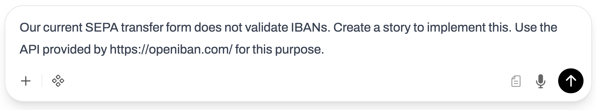
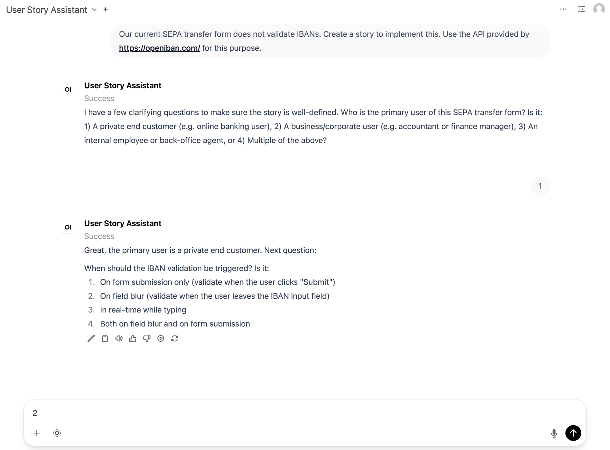
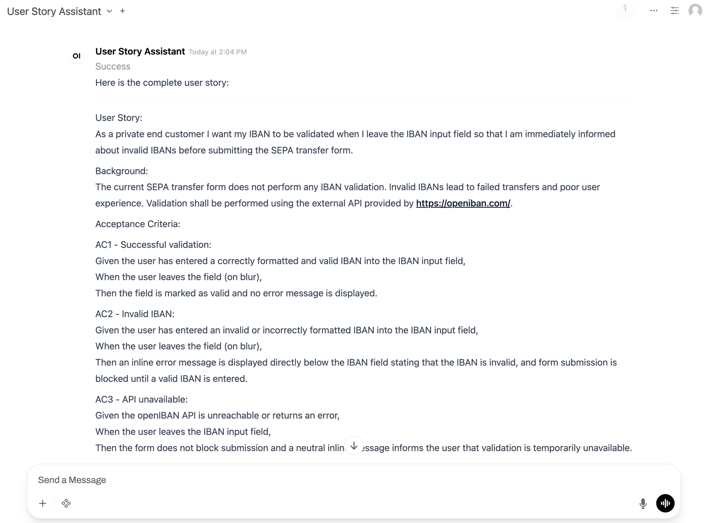
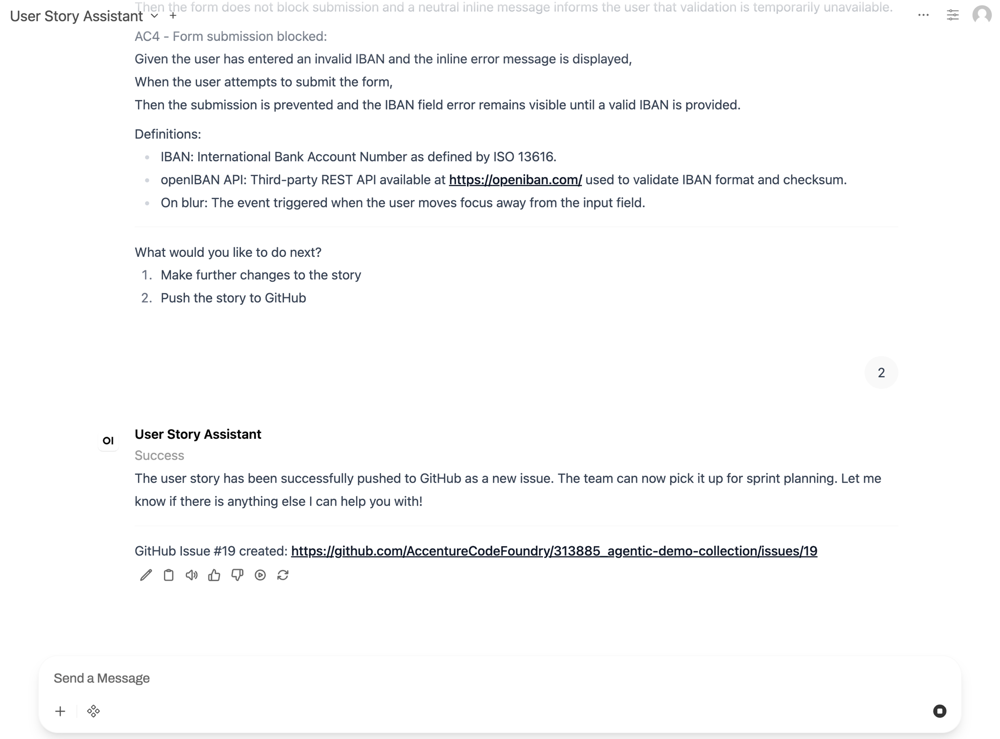
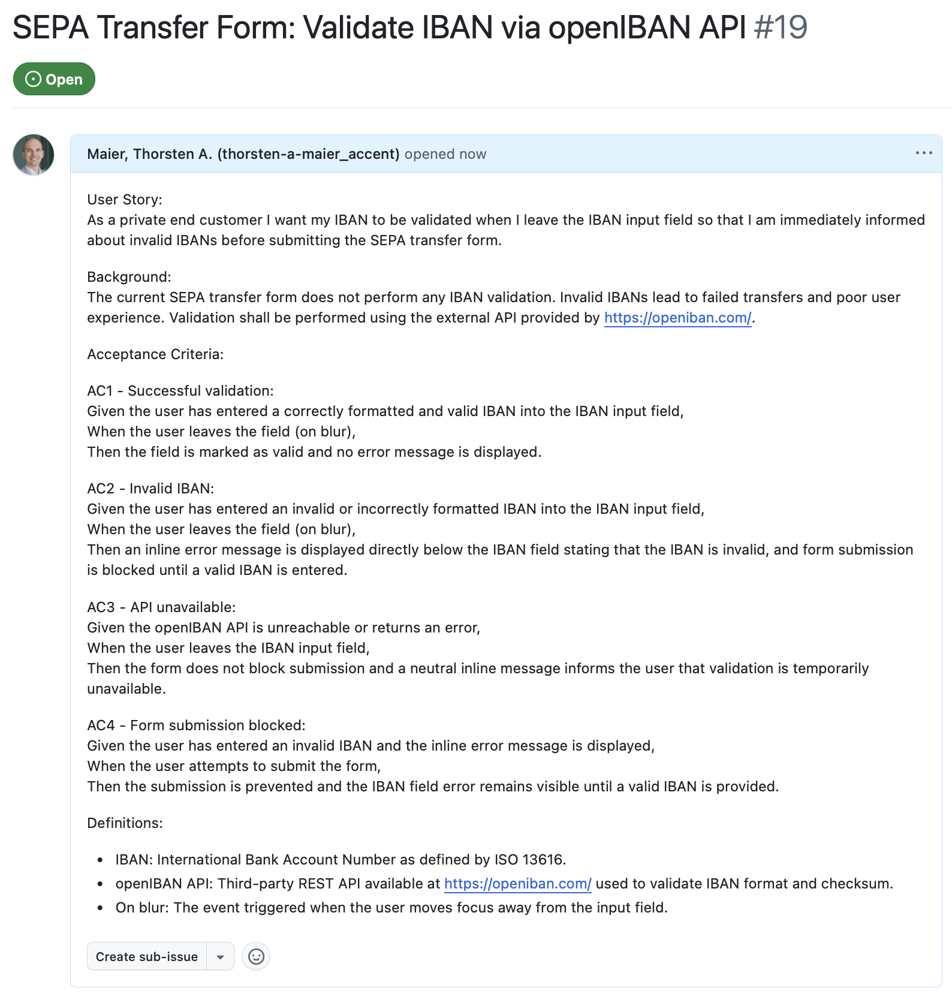
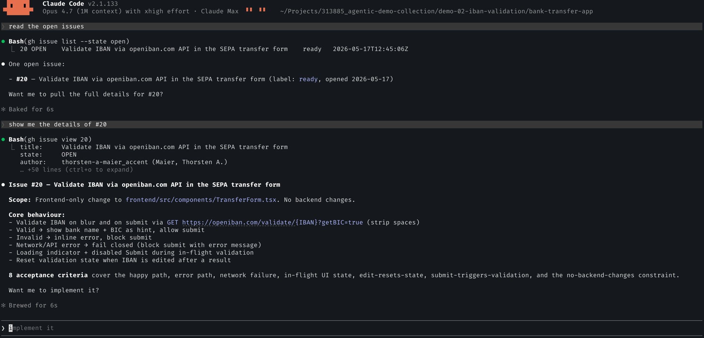
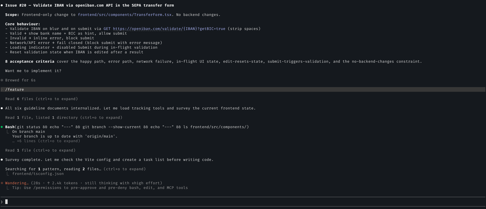

# Demo 02 — IBAN Validation — Agent Garage variant — Playbook

This is the **canonical 3-phase playbook** for the Agent Garage flavour of
Demo 02. Everything you need to set up, demo, and verify is in this one file.

> Demo 02 has two variants — this one (Agent Garage: n8n + Open WebUI + Claude
> Code) and an Agentic Studio variant. They tell the same story but use
> different tooling. Make sure you mean the right one before you start.

The demo follows the narrative of the workshop deck
[`../docs/03-IBAN-Validation.pptx`](../docs/03-IBAN-Validation.pptx) — a single
user story moves through three handovers across three actors using three tools
and three Claude-powered agents:


| Phase | Actor | Tool | Deliverable |
|---|---|---|---|
| 1 | Product Owner | OpenWebUI chat → User Story Assistant pipe → n8n | User story as **GitHub issue** |
| 2 | Developer | Terminal with Claude Code, inside `bank-transfer-app/` | Backend + frontend + unit/integration tests, **PR** |
| 3 | UI Tester | IDE (VS Code) with Claude Code, same repo, same branch | **Selenium E2E suite** mapped 1:1 to acceptance criteria |

---

## 1. What's in the box

```
demo-02-iban-validation/
├── README.md                                  ← entry point / variants overview
├── RUNBOOK.md                                 ← thin orientation
├── bank-transfer-app/                         ← Phase 2 START state (no validation)
├── ui-test-reference/                         ← Phase 3 reference deliverable
│   ├── README.md                              ← AC ↔ test mapping + integration steps
│   ├── pom-additions.xml                      ← Maven snippets to add to bank-transfer-app
│   └── src/test/java/.../IbanValidationE2E.java
├── docs/
│   ├── 03-IBAN-Validation.pptx                ← workshop deck
│   ├── slides/slide-01..11.jpg                ← rendered slides, referenced inline below
│   ├── screenshots/phase-1/                   ← live-run screenshots, referenced inline
│   └── flow.md                                ← slide-by-slide commentary
└── agent-garage-variant/                      ← Phase 1 stack + tests + this runbook
    ├── RUNBOOK.md                             ← THIS FILE
    ├── stack/
    │   ├── docker-compose.yml                 ← postgres + n8n + openwebui (+ init containers)
    │   ├── .env.example
    │   ├── n8n/backup/
    │   │   ├── workflows/6_User_Story_Assistant_GitHub.json
    │   │   └── credentials/                   ← user-provided, gitignored
    │   └── openwebui/
    │       ├── functions/user_story_creator.py
    │       └── import_functions.py
    └── tests/
        ├── e2e_webhook.py                     ← direct n8n webhook regression
        ├── e2e_owui.py                        ← Playwright through real OWUI
        ├── requirements.txt
        └── README.md
```

---

## 2. Architecture — Phase 1 stack

```
 ┌──────────────────┐    chat msg     ┌──────────────────────┐    webhook    ┌─────────────────────┐
 │  Open WebUI      │────────────────▶│  user_story_creator  │──────────────▶│  n8n workflow 6     │
 │  (browser chat)  │                 │  pipe function       │   chatInput   │  (Webhook → Agent → │
 │  :3000           │◀────────────────│  (Python in OWUI)    │◀──────────────│   Switch → Gate →   │
 └──────────────────┘    response     └──────────────────────┘    JSON       │   GitHub → Respond) │
                                                                             │  :5678              │
                                                                             └──────────┬──────────┘
                                                                                        │
                                                                                        ▼ Anthropic API
                                                                                ┌─────────────────┐
                                                                                │ Claude Sonnet   │
                                                                                │ 4.6             │
                                                                                └─────────────────┘
```

- **Open WebUI** (`openwebui`, port 3000) — chat front-end. The "User Story
  Assistant" model is a *Pipe Function* that forwards every chat message to n8n.
- **n8n** (`n8n`, port 5678) — workflow engine. Workflow 6 runs the LLM
  conversation, parses structured output, enforces a confirmation gate, and
  creates a GitHub issue when the user confirms.
- **PostgreSQL** — n8n's persistence layer.

Phases 2 and 3 don't need the Phase 1 stack at all — they only need a checkout
of `bank-transfer-app/`, the Claude Code CLI, and the standard dev stack
(Java 17 + Maven, Node + npm, Chrome for Phase 3).

### Two safeguards against accidental pushes (Phase 1)

1. **Prompt-level**: the system prompt forbids `push_to_github` unless the
   user's *current* message is a short, unambiguous confirmation.
2. **Workflow-level Confirmation Gate** (IF node): blocks even if the LLM
   misbehaves — only short messages starting with a confirmation keyword
   (`push|yes|ja|ok|okay|go|2|publish|send|do it|los|raus damit`) pass through.

---

## 3. Prerequisites

| Component | Phase | Setup |
|---|---|---|
| Docker / Docker Compose v2 (or podman + podman-compose) | 1 | runs the stack |
| Anthropic API key | 1, 2, 3 | n8n credential (Phase 1) + Claude Code login (Phases 2, 3) |
| GitHub Personal Access Token (`repo` scope) | 1, 2 | n8n credential (Phase 1) + `gh auth login` (Phase 2 for PR creation) |
| `gh` CLI | tests | verifies issue creation in the automated regression |
| Python ≥ 3.10 | tests | runs `e2e_owui.py` and `e2e_webhook.py` |
| Java 17 + Maven | 2, 3 | backend build + Selenium runtime |
| Node.js 18+ + npm | 2, 3 | frontend dev server |
| Chrome | 3 | Selenium WebDriver |
| Claude Code CLI (`claude`) | 2, 3 | authenticated, on PATH |

---

## 4. First-time setup (Phase 1 stack)

### 4.1 Configure the environment

```bash
cd demo-02-iban-validation/agent-garage-variant/stack
cp .env.example .env

# Generate strong secrets
python3 -c "import secrets; print('N8N_ENCRYPTION_KEY=' + secrets.token_hex(32))" >> .env
python3 -c "import secrets; print('N8N_USER_MANAGEMENT_JWT_SECRET=' + secrets.token_hex(32))" >> .env

# Edit .env and replace the placeholder secret lines with the generated ones,
# then fill in ANTHROPIC_API_KEY=sk-ant-…
```

### 4.2 Bring the stack up

```bash
docker compose up -d
docker compose logs -f n8n openwebui openwebui-functions-import
# wait until n8n shows "Editor is now accessible via: http://localhost:5678"
# and openwebui-functions-import logs "function import done"
```

Smoke check:
```bash
curl -sf http://localhost:5678/healthz   # n8n
curl -sf http://localhost:3000/health    # OpenWebUI
```

### 4.3 Configure n8n credentials (one-time, manual)

The workflow JSON ships with credential **placeholders**. You must create the
real credentials inside n8n and link them to the nodes.

1. Open <http://localhost:5678>, finish n8n's first-run setup (create owner
   account; this is **separate from Open WebUI's admin user**).
2. Sidebar → **Credentials → New** → **Anthropic API** → paste your Anthropic
   key, name it "Anthropic account", **Save**.
3. Sidebar → **Credentials → New** → **GitHub API** → paste a Personal Access
   Token with `repo` scope, name it "GitHub account", **Save**.
4. Open workflow **"6 - User Story Assistant with GitHub Integration"**.
5. Click node **Anthropic Chat Model** → pick the credential you just created → **Save**.
6. Click node **Create an issue1** → pick the GitHub credential → also confirm
   the **Owner** and **Repository** point at your target repo. **Save**.
7. **Activate** the workflow (top-right toggle).

### 4.4 Verify the OpenWebUI pipe

The `openwebui-functions-import` init container has already imported the pipe
and pointed its `n8n_url` valve at the right webhook path
(`http://n8n:5678/webhook/<N8N_WEBHOOK_PATH>` from `.env`).

Verify:
1. Open <http://localhost:3000>, login `admin@test.com` / `admin123`
   (override via `.env` `OWUI_ADMIN_EMAIL` / `OWUI_ADMIN_PASSWORD` before first
   start).
2. **Admin Panel → Functions** → **User Story Assistant** should be **active**.
3. Click "Edit" → check the valves at the bottom right of the editor:
   `n8n_url` must be `http://n8n:5678/webhook/880e3fd7-2418-4344-80e0-91f8305cab86`
   (or whatever you set as `N8N_WEBHOOK_PATH`).

---

## 5. Demo timing

| Phase | Real-time | What the audience sees |
|---|---|---|
| 1 — PO chat | 3–5 min | Conversational user story creation + push to GitHub |
| 2 — Developer plan | 3 min | Claude Code prints structured plan, operator approves |
| 2 — Developer implement | 4–6 min | Live coding, diffs streaming |
| 2 — Manual test | 1 min | Browser shows real bank details from openIBAN |
| 3 — UI tester plan | 2 min | Claude Code reads docs, builds 7-step plan |
| 3 — UI tester implement | 3–5 min | Selenium test class is written, runs all green |
| **Total** | **15–20 min** | end-to-end agentic SDLC |

---

# Phase 1 — Product Owner writes the story (Chat)

**Tool**: Open WebUI chat at <http://localhost:3000>, model **User Story
Assistant** (a Python *Pipe* that forwards every message to n8n workflow 6).

### 5.1 Manual demo script

1. Open <http://localhost:3000>, log in as admin.
2. **+** for a new chat → model selector: **"User Story Assistant"**.
3. Send the canonical demo prompt:

   > Our current SEPA transfer form does not validate IBANs. Create a story to
   > implement this. Use the API provided by https://openiban.com/ for this
   > purpose.

   

4. The assistant asks **clarifying questions one at a time** (typically:
   target user, then when the validation should fire). Answer with the number
   of the matching option. The agent persists answers across turns and builds
   the story incrementally.

   

5. Once enough context is gathered, the assistant returns the **complete user
   story** (title, background, 3–5 GWT acceptance criteria, definitions) and
   offers:

   > 1. Make further changes to the story
   > 2. Push the story to GitHub

   

6. To create the GitHub issue, send `push` (or `yes` or `2`). The chat reply
   ends with a permalink:

   `GitHub Issue #N created: https://github.com/AccentureCodeFoundry/…/issues/N`

   

7. Open the link to verify the issue was filed with the exact story contents
   the chat showed:

   

> **Note** — the number of clarification questions varies (1–3 in practice).
> Less context in the initial prompt → more clarifications. The screenshots
> above are from a run that took **2 clarifications**.

**Deliverable for Phase 2**: the GitHub issue number `#N`.

### 5.2 Demonstrating the safeguard (optional)

To show the Confirmation Gate visibly:

1. In a fresh chat, paste the entire story in your first message and **append**
   `…and push it now to GitHub.`
2. The assistant refuses (`action=create`) because the prompt-level safeguard
   forbids first-turn pushes that contain story content.
3. Even if you re-prompt aggressively, the workflow's IF gate ensures no GitHub
   call happens unless your current message is a short confirmation.

---

# Phase 2 — Developer agent implements

**Tool**: terminal with Claude Code (`claude`) running inside
`bank-transfer-app/`.

Bring the app up first so the agent can verify changes against a running
process:
```bash
cd demo-02-iban-validation/bank-transfer-app
mvn spring-boot:run                                    # http://localhost:8089
(cd frontend && npm install && npm run dev)            # http://localhost:5173
```

### 6.1 Pull the ticket context

Open another terminal in `bank-transfer-app/` and run `claude`. The developer
first explores the backlog conversationally — no slash command yet, just two
natural-language prompts that exercise the `gh` MCP / CLI integration:

```
read the open issues
```
```
show me the details of #N
```

Claude lists open issues, then pulls the full body of `#N` (title, scope, core
behaviour, acceptance criteria) and asks **"Want me to implement it?"**:



**Talking point**: *"This is plain `gh` under the hood, but the agent decides
which fields matter and surfaces them as a readable brief. The operator now
has the same shared context the agent has — before any code gets written."*

### 6.2 Hand over to the feature workflow

Rather than answering "implement it" in free text, the developer invokes the
project's structured slash command:

```
/feature
```

`/feature` resolves to [`.claude/commands/feature.md`](../bank-transfer-app/.claude/commands/feature.md),
which forces the agent into a disciplined sequence: load all guidelines, take
stock of the current frontend state, then plan before writing any code:



**Talking point**: *"The slash command is the contract between the developer
and the agent. Six guideline files — coding, security, regulatory, testing —
get loaded every single time, so nothing is left to memory or vibes."*

### 6.3 Watch the plan

Claude reads the wiki:
- `CLAUDE.md` (project quick reference)
- `wiki/architecture/CodingGuidelines.md`
- `wiki/security/SecurityGuidelines.md`
- `wiki/regulatory/Regulatory.md`
- `wiki/testing/TestingStrategy.md`
- the Jira/GitHub ticket

…then prints a 7-step plan. The first two sections cover **Regulatory Impact**
(PSD2 / GDPR / AML / MaRisk applicability) and **API Contract** (OpenAPI
sketch of `GET /api/iban/validate/{iban}` plus response shapes):


Step 3 enumerates the seven Java files that will be created (controller,
service, models, error handling, REST template config) plus the changes to
`application.properties` and `WebConfig`. Step 4 lists the **security
controls** that follow from `SecurityGuidelines.md` — `@Pattern` input
validation, PII masking on logging, secrets management, structured logging:


Step 5 maps every UI state to concrete behaviour. Step 6 lists the **test
inventory**: unit + integration + frontend unit (E2E comes in Phase 3). The
"Quality Gates in CI" panel shows the merge blockers:


Finally the agent prepares the PR — branch name, PR title, 12-file change
manifest, implementation order — and asks **"Shall I proceed with
implementation?"** (first checkpoint):


**Talking point**: *"Notice the agent didn't start coding immediately. It
read your written standards first, derived the controls that must apply, and
gave you a chance to abort."*

### 6.4 Approve and implement

Answer `yes, go ahead`. Claude executes the plan in order, showing each diff
inline — branch creation, `pom.xml` / `application.properties` / `WebConfig`
edits, model records, services, controllers, frontend changes, backend tests:


### 6.5 Implementation-complete summary

Claude prints a final per-file table with **purpose** and **security
controls applied**, totals (21 tests: 14 unit + 5 integration + 2 existing),
and asks **"Would you like me to commit this and create a PR?"** (second
checkpoint):


### 6.6 Manual test in the browser

Operator switches to <http://localhost:5173>. Paste a real IBAN
(`DE89 3704 0044 0532 0130 00` works against openIBAN). The form shows a
green checkmark, *"IBAN verified"* and the live bank details panel:


Paste an invalid IBAN — red error, submit button disabled.

**Deliverable for Phase 3**: a green PR on branch
`feat/DEM-N-iban-validation` with backend + frontend + unit/integration tests
but **no** E2E tests yet.

---

# Phase 3 — UI Tester agent adds Selenium tests

**Tool**: Claude Code running inside an IDE (VS Code), pointed at the same
`bank-transfer-app/` repo on the Phase 2 branch.

### 7.1 Hand the branch to the UI Tester agent

In VS Code with the Claude Code panel open, on branch
`feat/DEM-N-iban-validation`, run the slash command:
```
/frontend-test DEM-N
```
(`.claude/commands/frontend-test.md` defines the workflow.)

The agent reads `frontend-test.md`, `TestingStrategy.md`, `CodingGuidelines.md`,
`SecurityGuidelines.md`, fetches the Jira/GitHub ticket via MCP, and confirms
the branch:


### 7.2 Watch the plan

Claude produces a 7-Todo plan: identify ticket → analyse implementation → map
acceptance criteria to test cases → create Selenium UI test class → add
Selenium dependencies → run and verify tests → commit and update Jira ticket.
It then reads `TransferForm.tsx`, controller, service, models, `pom.xml`,
`application.yml`, and checks whether E2E tests or Vite test config already
exist:


### 7.3 Implementation and run

Claude:
1. Adds the Selenium dependency + surefire `*E2E.java` glob to `pom.xml`
   (see [`../ui-test-reference/pom-additions.xml`](../ui-test-reference/pom-additions.xml)).
2. Writes `src/test/java/com/demobank/transfer/e2e/IbanValidationE2E.java`
   with **11 tests** mapped 1:1 to AC1–AC5 + 2 edge cases.
3. Runs `mvn test -Dtest=IbanValidationE2E` against the same dev ports the
   app already runs on (backend `8089`, frontend `5173`).
4. Reports `11/11 E2E tests passing` and asks to commit on branch
   `feat/DEM-N-iban-validation`:


Reference test class:
[`../ui-test-reference/src/test/java/com/demobank/transfer/e2e/IbanValidationE2E.java`](../ui-test-reference/src/test/java/com/demobank/transfer/e2e/IbanValidationE2E.java).
For the full AC ↔ test mapping table see
[`../ui-test-reference/README.md`](../ui-test-reference/README.md).

**Deliverable for the demo**: Phase 2 PR plus a follow-up commit on the same
branch adding the 11 Selenium tests, all green.

---

## 8. Automated regression (Phase 1)

Phases 2 and 3 are not automated end-to-end because they involve Claude Code
reasoning live. For Phase 1 we ship two regression tests.

### 8.1 Direct webhook test (fast, no browser)

Best for CI and quick regression after workflow edits.

```bash
cd demo-02-iban-validation/agent-garage-variant/tests
python3 -m venv .venv && source .venv/bin/activate
pip install -r requirements.txt
python e2e_webhook.py
```

Asserts:
- **Scenario A** — SEPA IBAN prompt + clarifications + `push` creates a new
  GitHub issue with "iban" in the title.
- **Scenario B** — a long first-turn push attempt creates **no** GitHub issue
  (Confirmation Gate holds).

### 8.2 Full browser E2E (real Open WebUI)

```bash
cd demo-02-iban-validation/agent-garage-variant/tests
source .venv/bin/activate
playwright install chromium
python e2e_owui.py
# screenshots: ./shots/
```

Same assertion as 8.1 scenario A, but through the actual Open WebUI chat UI
(login, model selection, message bubbles, response streaming).

---

## 9. How the workflow works (Phase 1 internals)

Workflow: **"6 - User Story Assistant with GitHub Integration"**. n8n assigns
a fresh ID on each import — reference by name or by webhook path, not by ID.

### Node graph

```
[Webhook]
   │
   ▼
[User Story Creator]  ◀── ai_languageModel ◀── [Anthropic Chat Model]
   │                   ◀── ai_memory       ◀── [Simple Memory]
   │                   ◀── ai_outputParser ◀── [Structured Output Parser]
   ▼
[Switch]
   ├── push_to_github ▶  [Confirmation Gate (IF)]
   │                         ├── true  ▶ [Create an issue1] ▶ [Set Response] ┐
   │                         └── false ▶ [Require Confirmation] ──────────┐  │
   └── default ──────────────────────────────────────────────────────┐    │  │
                                                                     ▼    ▼  ▼
                                                            [Respond to Webhook]
```

### Confirmation Gate condition (IF node, AND combinator)

| # | Operator | Value |
|---|---|---|
| 1 | `chatInput.length` < | `80` |
| 2 | `chatInput` matches regex | `^[\s\W]*(push\|yes\|ja\|ok\|okay\|go\|2\|publish\|send\|do it\|los\|raus damit)\b` (case-insensitive via `caseSensitive: false`) |

### Webhook contract

Request (POST `/webhook/<path>`):
```json
{ "sessionId": "owui-chat-id-or-anything", "chatInput": "user message" }
```

Response (always wrapped in an array because of `respondWith: allIncomingItems`):
```json
[ { "output": { "message": "rendered chat response …" } } ]
```

The OpenWebUI pipe extracts `[0].output.message` and renders it as the
assistant turn.

---

## 10. Common changes

### Change LLM model
Edit `Anthropic Chat Model` node in the workflow JSON or the n8n UI. The
demo was tested with `claude-sonnet-4-6`. Other Claude models work as long
as they support structured output / JSON mode.

### Change target repo
Edit `Create an issue1` node — fields `owner` and `repository`. Re-import the
workflow JSON or save in the UI.

### Change webhook path
Two places must stay in sync:
1. `Webhook` node `path` parameter inside the workflow.
2. `N8N_WEBHOOK_PATH` in `stack/.env`. Restart `openwebui-functions-import` to
   re-push the valve:
   ```bash
   docker compose up -d --force-recreate openwebui-functions-import
   ```

---

## 11. Troubleshooting

| Phase | Symptom | Likely cause | Fix |
|---|---|---|---|
| 1 | Chat returns "Connection error: n8n is not reachable." | Workflow not activated | Toggle "Active" in n8n UI |
| 1 | Push request creates no GitHub issue | GitHub credential expired or wrong repo | Recreate token, re-link credential on `Create an issue1`, verify Owner/Repo |
| 1 | `400 invalid_request_error` from Anthropic in n8n logs | Anthropic credit balance / wrong key | Top up balance or rotate key |
| 1 | `Bad request - please check your parameters` on `Anthropic Chat Model` | Model name no longer supported | Switch to a current Claude Sonnet model |
| 1 | Push response shows ` $json.key` or `undefined` | You're running an old (pre-fix) version of the workflow | Re-import `6_User_Story_Assistant_GitHub.json` |
| 1 | Confirmation Gate blocks every push, including short ones | Regex contains an unsupported `(?i)` inline flag — n8n needs JS-flavour regex | Use `caseSensitive: false` on the conditions instead |
| 1 | OpenWebUI shows endless "Your request is being processed…" | n8n call still in flight, or pipe got an exception | `docker compose logs -f n8n openwebui` |
| 1 | Podman: `dependency graph for container ... not found in input list` on `docker compose up n8n` | Known podman-compose bug when `depends_on: service_completed_successfully` references an already-completed init container | Delete the init container after it succeeds (`podman rm n8n-import`) and start n8n via `podman start n8n`, or start n8n with raw `podman run` using the env from `docker-compose.yml` |
| 1 | Fresh OpenWebUI: `openwebui-functions-import` exits 1 with `400 The email or password ... is incorrect` | OpenWebUI has no users yet — first user must be created via signup | `curl -X POST http://localhost:3000/api/v1/auths/signup -H 'Content-Type: application/json' -d '{"name":"Demo Admin","email":"admin@test.com","password":"admin123"}'`, then `docker compose up -d --force-recreate openwebui-functions-import` |
| 1 | Imported pipe shows up but model selector doesn't list "User Story Assistant" | Pipe not toggled active | Newer `import_functions.py` toggles it automatically. Otherwise manually toggle it under <http://localhost:3000/admin/functions>. |
| 1 | Workflow ID in n8n differs from the one in URLs/notes | n8n assigns fresh IDs on `import:workflow` | Reference workflows by name or webhook path, not by ID |
| 2 | Claude does not find the ticket | `gh` not authenticated for the repo, or wrong issue number | `gh auth status` + verify issue number from Phase 1 |
| 2 | App won't start on port 8089 | Another process is bound | `lsof -i :8089` and kill the offending process |
| 3 | Selenium `TimeoutException` waiting for `"Validating…"` text | Validation can resolve faster than Selenium polls (debounce window is tight) | Verify backend + frontend are both running before `mvn test`; rerun |
| 3 | ChromeDriver / browser version mismatch | Local Chrome upgraded without Selenium upgrade | Update Chrome or bump `selenium.version` in `pom.xml` |

### Manual webhook smoke test
```bash
curl -s -X POST http://localhost:5678/webhook/880e3fd7-2418-4344-80e0-91f8305cab86 \
  -H "Content-Type: application/json" \
  -d '{"sessionId":"smoke-001","chatInput":"hello"}'
```

### Check n8n executions
Open <http://localhost:5678> → workflow "6 - User Story Assistant…" → tab
**Executions**. The execution view shows which node failed and the full
request/response of the GitHub call.

---

## 12. History — what was fixed during bring-up

The workflow originally targeted Jira. Migration to GitHub introduced three
bugs that the shipped `6_User_Story_Assistant_GitHub.json` already resolves:

1. **Jira-leftover field** — `Set Response` referenced `$json.key`. Fixed to
   `$json.number` + `$json.html_url`.
2. **Mixed action naming** — system prompt, Switch and parser still used
   `push_to_jira`. Unified to `push_to_github`.
3. **No safeguard against first-turn push** — added the IF-based Confirmation
   Gate (short message + confirmation keyword) and tightened the prompt with
   the `CRITICAL CONFIRMATION SAFEGUARD` section.

The pipe (`user_story_creator.py`) was a generic n8n template ("Cole Medin's
N8N Pipe Function"). Renamed to "User Story Assistant" so the model dropdown
in OpenWebUI shows something meaningful; valve `n8n_url` auto-points at the
active webhook path via `import_functions.py`.
