# Demo 02 — IBAN Validation — Agentic Studio variant — Playbook

This is the **canonical playbook** for the Agentic Studio flavour of
Demo 02. Everything you need to set up, demo, and verify is in this one file.

> Demo 02 has two variants — this one (Agentic Studio: Accenture Agent
> Execution Environment) and an Agent Garage variant (n8n + Open WebUI +
> Claude Code). They tell the same story but use different tooling. Make
> sure you mean the right one before you start.

The deliverable is the same as in the Agent Garage variant: a working IBAN
validation feature in the SEPA transfer app, driven end-to-end by an
agentic SDLC team.

### Team composition (this variant)

For simplicity the Agentic Studio variant runs with **three** roles instead
of four — the UI Tester is dropped:

| Role | Responsibility |
|---|---|
| Business Analyst | Talks with the human PO, shapes the user story, opens a GitHub issue |
| Developer | Picks up the issue, implements backend + frontend + unit/integration tests, opens a PR |
| Code Reviewer | Reviews the PR against the wiki standards, approves or requests changes |

---

## 1. First-time setup — create the agent team

Agentic Studio bundles the team-creation flow into a **Team Wizard** with
five steps: *Team → Working Environment → Knowledge → Members → Review*.
Each step is documented in its own section below.

### 1.1 Team Wizard — Step 1: Team

Open Agentic Studio at <http://localhost:4000>. In the left sidebar pick
**Team Wizard** ("Multi-role GitHub team"). The first step asks for a team
name; the slug is derived automatically and will prefix every resource the
wizard creates (agents, working environment, GitHub config).

- **Team Name**: `Bank Transfer Team`
- **Team ID (slug)**: `bank-transfer-team` (auto-derived)

The Team role itself is a *configuration template* — you don't create it
manually. Every agent the wizard provisions in Step 4 will inherit from it.

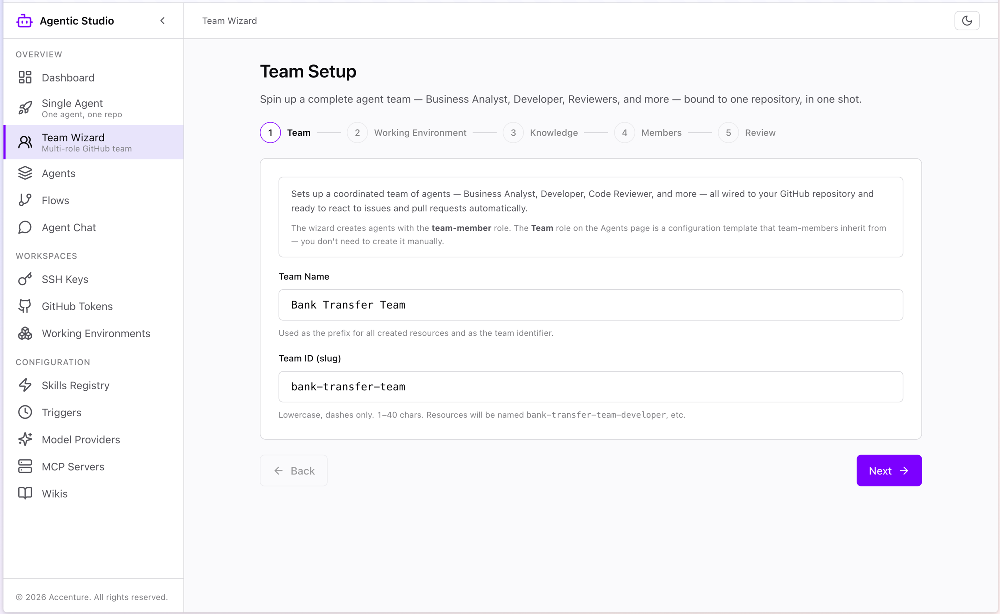

Continue with **Next →**.

### 1.2 Team Wizard — Step 2: Working Environment

Step 2 binds the team to a GitHub repository and picks the credentials the
agents will use to talk to GitHub. Two separate credentials are required by
design (defense-in-depth — see the inline "Why two credentials?" note in the
screenshot):

| Field | Pick from | Purpose |
|---|---|---|
| **SSH Deploy Key** | dropdown of SSH keys registered under *SSH Keys* in the sidebar | clones the repo via SSH (per-repo, read-only deploy key works) |
| **GitHub Personal Access Token** | dropdown of PATs registered under *GitHub Tokens* in the sidebar | drives `gh` for PR / issue / comment actions and verifies the repo URL above |
| **GitHub Repository URL** | typed in | the repo the agents will work against |
| **Branch** | dropdown of actual branches in that repo | working branch (default: `main`) |

For this demo we use the existing credentials `acf-ssh-key` and
`acf-github-token`, and point the team at
`https://github.com/AccentureCodeFoundry/313885_agentic-demo-collection/` on
branch `main`. The studio probes the URL with the PAT and shows a green
**Verified** badge plus a branch count when it succeeds.

If you don't have a deploy key yet, click **Generate new SSH key** — it
produces a fresh ed25519 key pair and you add the public half to the repo's
*Deploy keys* on github.com afterwards.

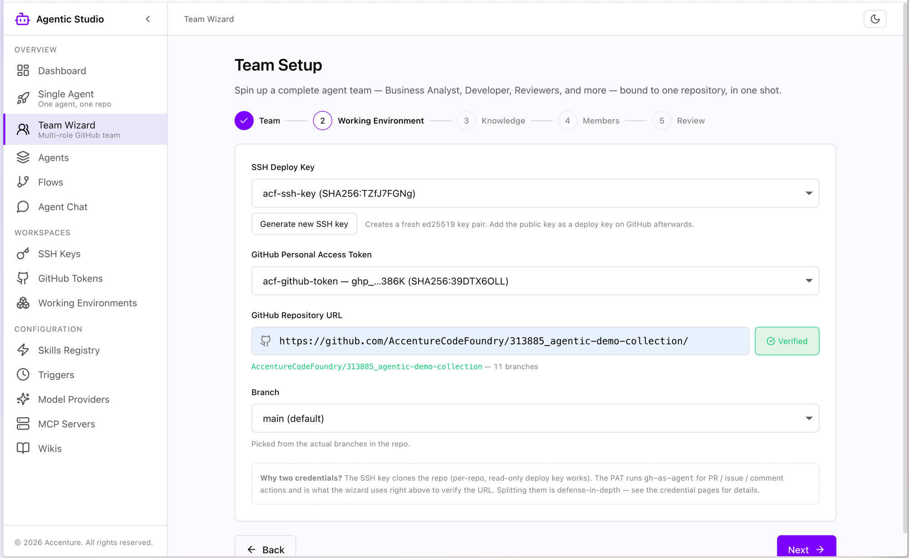

Continue with **Next →**.

### 1.3 Team Wizard — Step 3: Knowledge

Step 3 attaches **knowledge sources** to the team. Under the hood every
knowledge source is an MCP server the agents can query at runtime. Each
team member inherits the team-wide selection by default and can override it
later via the agent edit form.

For this demo we use the simplest option — a **local markdown wiki**
auto-managed by the studio (entry `Wiki: Default (local-wiki-default)`).
It already contains our development-process notes (coding guidelines,
security guidelines, regulatory rules, testing strategy, etc.).

External knowledge backends — **Confluence**, **vector databases**,
**graph knowledge stores**, and so on — plug in here the same way: register
them as MCP servers under *MCP Servers* in the sidebar, then pick them in
this step. Mixing several sources is supported; the team-wide selection
applies to every member by default.

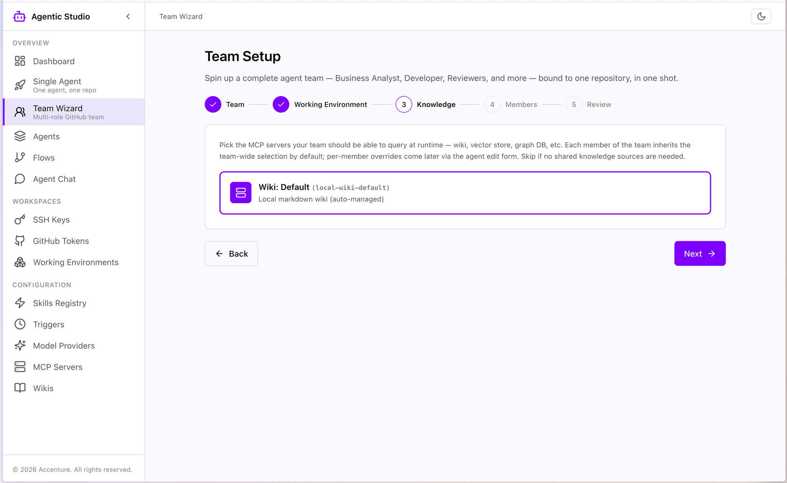

Continue with **Next →**.

### 1.4 Team Wizard — Step 4: Members

Step 4 is where you pick the roles that make up your team. The studio
ships with **many pre-configured roles** — Architect, Backlog Hygiene,
Business Analyst, Code Reviewer, Community Manager, Compliance Reviewer,
Developer, Dispatcher, Documentation Sync, Issue Triage, Legal Approver,
and so on. Each card states the role's purpose and the triggers it reacts
to (cron schedules, GitHub webhooks, chat).

The "**View workflow diagram**" button at the top opens a visual map of how
the triggers and labels wire the roles together — useful if you're not sure
which combination of roles you need for a given flow.

For this demo we **deliberately under-staff** the team to keep it simple
and to show how easy custom role definition is. Pick exactly three members:

| # | Role from the catalogue | Why this one |
|---|---|---|
| 1 | **Business Analyst** (chat-driven, trigger `issues.closed` / `ba-issue-closed`) | The predefined role already does exactly what we need — talk to the human, refine requirements, open the GitHub issue. |
| 2 | **Generic Agent** (instances: **2**) | A blank-slate agent with no specialised prompt and no pre-activated triggers. We'll grow one of the two into a Developer and the other into a Code Reviewer in §2 below. |

> **Why not pick the predefined Developer and Code Reviewer?** They do exist
> in the catalogue — see the second screenshot. Picking them would be the
> shorter path for production. For this demo we go the longer way to show
> how a fresh agent gets shaped into a role from scratch.

Note that the UI Tester role from the Agent Garage variant is **not** part
of this team — the Agentic Studio walkthrough drops it for simplicity.

Pre-defined roles available — scrolled to the top of the catalogue (Business
Analyst highlighted):

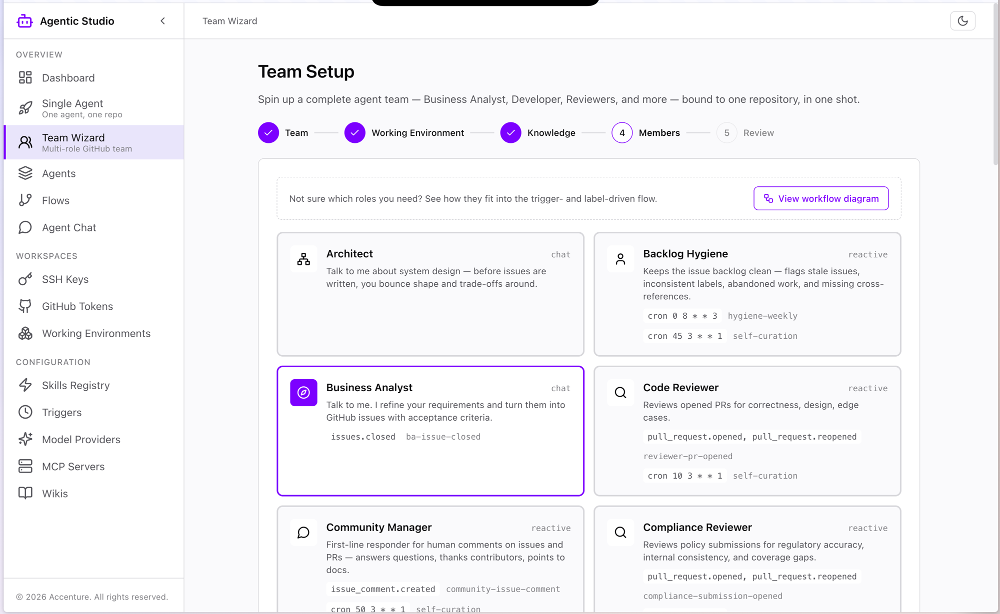

…and scrolled further down, with the **Generic Agent** card showing the
`Instances: 2` counter:

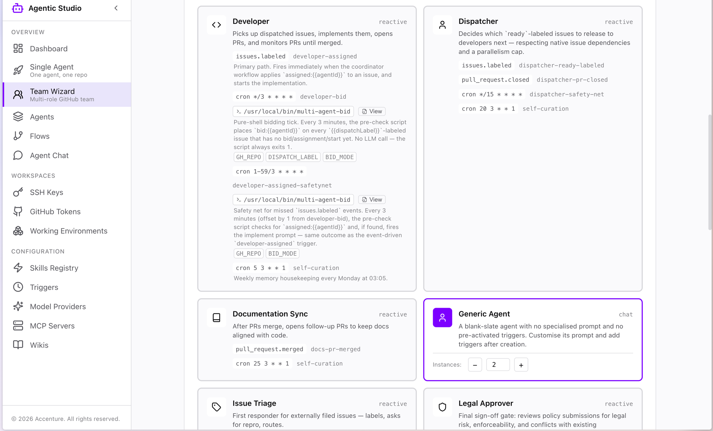

Continue with **Next →**.

### 1.5 Team Wizard — Step 5: Review & Create

The final step summarises everything before provisioning. Verify each field
against the values from §1.1–§1.4:

| Section | Expected value |
|---|---|
| Team | `Bank Transfer Team (bank-transfer-team)` |
| Repository | `https://github.com/AccentureCodeFoundry/313885_agentic-demo-collection/ @ main` |
| Ready label | `ready` (default) |
| SSH Key | `acf-ssh-key` |
| GitHub Token | `acf-github-token` |
| Knowledge sources (1) | **Wiki: Default** |
| Roles (2) | **Business Analyst** → `bank-transfer-team-business-analyst`<br>**Generic Agent × 2** → `bank-transfer-team-generic-1`, `bank-transfer-team-generic-2` |

The slug from Step 1 (`bank-transfer-team`) is the prefix the studio uses
for every resource it creates — note how each role's instance name follows
the `bank-transfer-team-<role>` pattern.

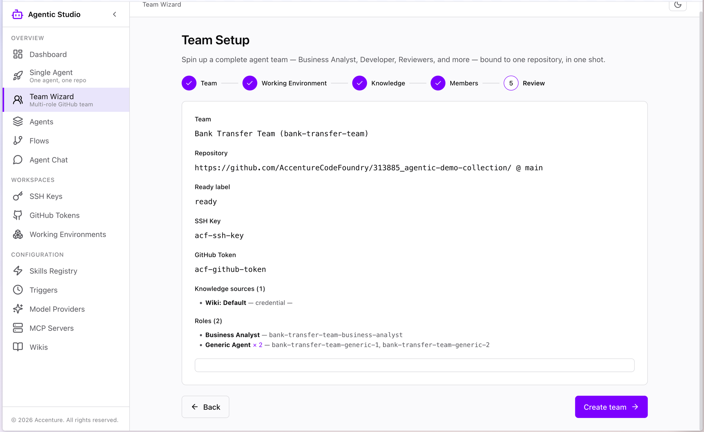

Hit **Create team →**. The studio now provisions the three agents in the
background. "Provisioning" here means:

1. Allocate a dedicated **working environment** (container / sandbox) per agent.
2. **Clone the repository** into each agent's workspace via the SSH deploy key.
3. Inject the team-level configuration (knowledge sources, GitHub PAT, role template).

After a short wait (typically under a minute), the team is live and you can
interact with the agents — chat with the Business Analyst, customise the two
Generic Agents into Developer and Code Reviewer, and watch them react to
GitHub events.

---

# Phase 1 — Business Analyst writes the story (Chat)

The Business Analyst we just provisioned is **chat-driven** and already
knows how to file GitHub issues — its prompt template and tool access were
set up by the predefined role. We talk to it the same way we'd talk to a
human BA: state what we need, answer its clarifications, let it draft the
story, then confirm.

### 2.1 Open the chat

In the sidebar pick **Agent Chat**, then in the agent list pick
**Bank Transfer Team · Business Analyst**. The chat opens in a fresh
session, scoped to branch `main` of the team's repository. The top bar
shows the live status, the active model (`claude-sonnet-4-6 · sonnet` for
this run) and gives you four session controls (New session, Full Learn,
Reset Session, Clear History).

### 2.2 Send the canonical prompt

Type the same prompt we use in the Agent Garage variant — with a
`Kontext:` line up front telling the BA which subfolder of the multi-demo
repo to scope to:

```
Kontext: demo02-iban-validation -> bank-transfer-app

Our current SEPA transfer form does not validate IBANs. Create a story to
implement this. Use the API provided by https://openiban.com/ for this
purpose.
```

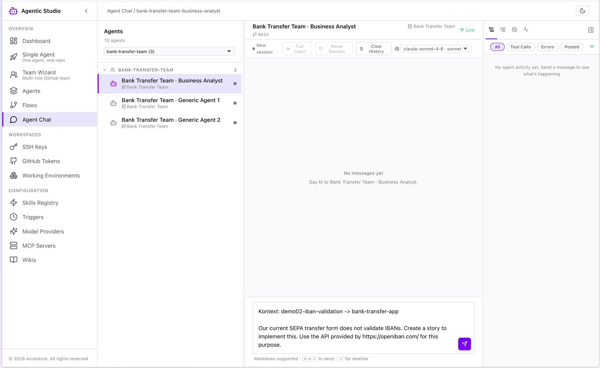

Hit the send button (or **⌘ + ↵**).

### 2.3 Watch the agent explore before answering

Unlike the Agent Garage variant — where the LLM only ever sees the chat
input — the Agentic Studio BA has **tool access** in its sandbox and uses
it before replying. The center pane shows a `thinking…` bubble while the
right-hand **Log** panel streams every step in real time:

- `Read /workspace/agents/bank-transfer-team-…` — opens the cloned repo
- `Glob ./313885_agentic-demo-collection/**/*` — lists the multi-demo tree
- `WebFetch {"url":"https://openiban.com/", …}` — fetches the third-party
  API docs to ground the story
- `Bash ls -la …`, `Bash find …`, more `Read` — walks the bank-transfer-app
  to confirm where the IBAN field lives, what the backend currently does,
  and which related files already exist
- Interleaved `thinking` blocks that narrate the agent's plan as it goes

The right pane lets you filter to **Tool Calls**, **Errors**, or
**Posted** events if the full transcript gets noisy. The colored line on
the left edge of the pane is the **live activity rail** — green ticks mean
each tool call succeeded.

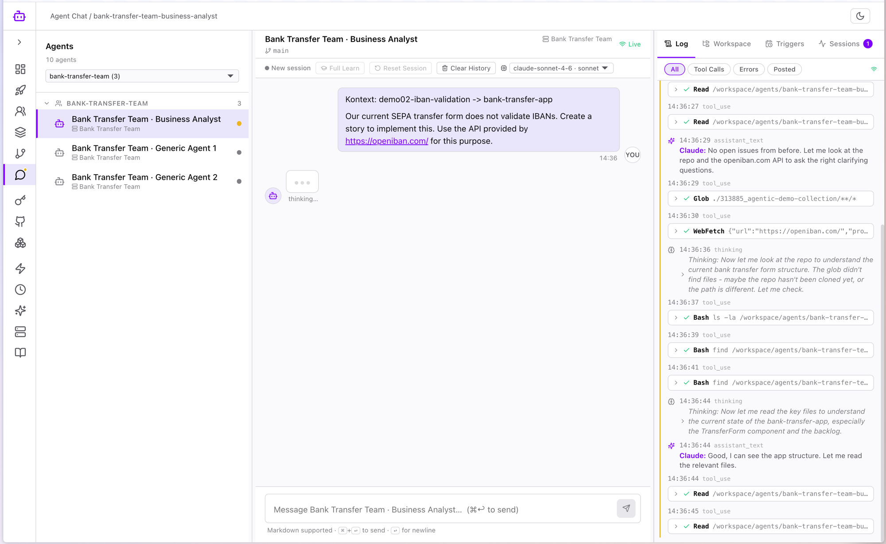

### 2.4 Read the BA's clarification questions

Once the agent has a working mental model of the codebase, it produces a
single, well-formatted reply in the chat — keeping all the noisy
exploration hidden in the log. The reply opens with a one-sentence
**finding** (the IBAN field exists in `TransferForm.tsx` but has zero
validation; the backend accepts anything) and continues with four
**clarification questions**:

1. **Where should the validation call happen?** — frontend only / backend
   only / both
2. **When to trigger the check?** — on blur / on submit / both
3. **Should the bank name be displayed as a trust signal?** — using the
   openiban.com bank-name+BIC response
4. **What happens if openiban.com is unreachable?** — fail open vs
   fail closed

The session header now shows the live spend so far (`$0.2444` for this run)
plus an execution summary in the log (`Done in 44907ms · in:47 out:2185`).

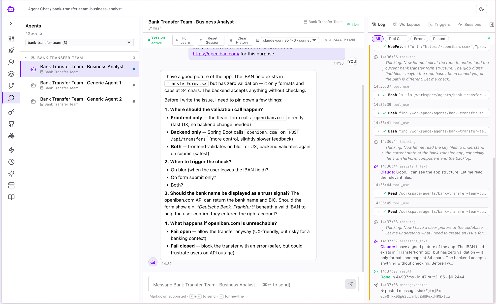

Answer the questions inline in the same chat to drive the BA towards the
final story.

### 2.5 Answer the questions, watch the issue get created

A terse one-liner that addresses all four questions in order is enough —
the BA correlates the answers positionally:

```
Frontend only Both Show the name Fail closed
```

The agent does **not** ask another round of clarifications. Instead it
goes straight to filing the issue. The log on the right shows the
machinery:

- `Bash which gh-as-agent` — probes the preferred CLI wrapper
- `Bash gh-as-agent issue create …` — **fails** (red ❌); the wrapper is for
  PR commits, not issue creation
- A `thinking` block diagnoses the mismatch: *"`gh-as-agent` doesn't have
  an `issue create` command — it's just a wrapper for git commit and
  stamping. I need to use the regular `gh` CLI for creating issues."*
- `Bash gh issue create …` — succeeds
- `Read context.md`, `Write context.md` — agent updates its working notes

The chat reply is concise: a link to **issue #20** plus a checkpoint:

> Issue #20 is open. Are you happy with the acceptance criteria as written?
> If yes, I'll apply the `ready` label so the Developer agent can pick it up.

The `ready` label is the trigger we set up in Step 5 of the wizard — it's
how the BA hands the issue off to the Developer (next phase).

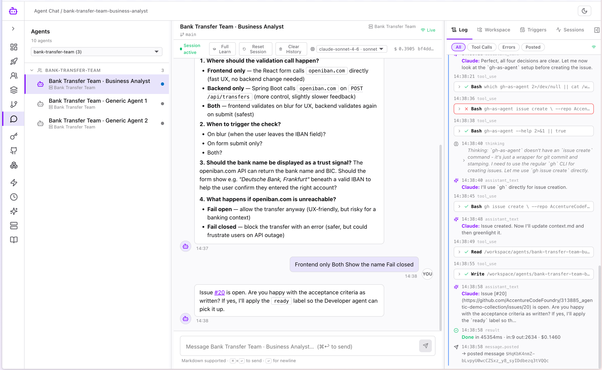

### 2.6 Inspect the created GitHub issue

Open the link the BA posted. The issue body is noticeably richer than the
Agent Garage version because the BA had **direct access to the repository**
while drafting it — it can pin down the exact file path
(`demo-02-iban-validation/bank-transfer-app/frontend/src/components/TransferForm.tsx`)
and split the behaviour by state:

- **Summary** — one paragraph framing
- **Scope** — exact file location + explicit "No backend changes"
- **Behaviour to Implement** — sub-sections per case:
  - *Validation trigger* — on blur + on form submit
  - *API call* — `GET https://openiban.com/validate/{IBAN}?getBIC=true`
    (spaces stripped beforehand)
  - *Valid IBAN* — display bank name + BIC as a hint, Submit enabled
  - *Invalid IBAN* — inline error, block submission
  - *API unreachable / network error* — inline error, fail closed
  - *Validation in progress* — loading indicator, disable Submit

Note the sidebar on GitHub shows an **Assign to Agent** button — that's
the Agentic Studio integration point that picks up `ready`-labelled issues
in Phase 2.

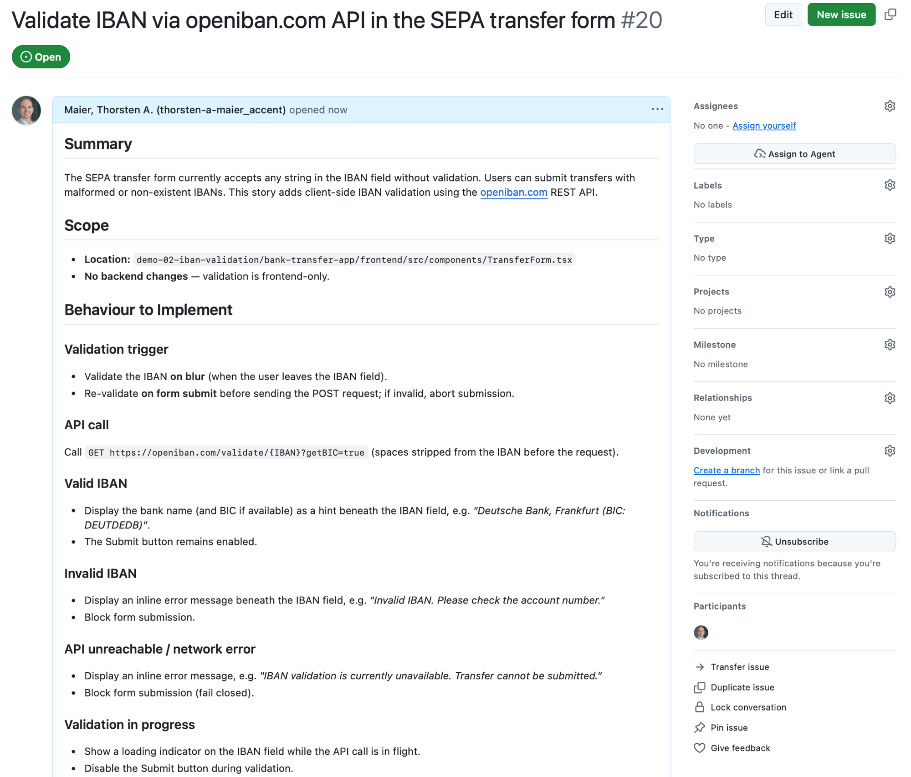

**Deliverable for Phase 2**: the GitHub issue number `#N` plus the BA's
confirmation chat — the moment you tell the BA "yes" it applies the
`ready` label, which the Developer agent's trigger reacts to.

---

# Phase 2 — Customise a Generic Agent into a Developer

Right after the BA has filed the issue but **before** we let it apply the
`ready` label, we shape one of the two Generic Agents from the team into a
fully-fledged **Developer**. The Developer needs to react automatically the
moment the BA stamps an issue as `ready` — so the customisation is a
**trigger** rather than a manual chat prompt.

> First housekeeping step: rename the two Generic Agents to **Developer**
> and **Code Reviewer** (we'll grow the second one in §4 below). The
> rename is purely cosmetic but keeps the agent list readable; the
> underlying instance IDs from the wizard
> (`bank-transfer-team-generic-1`, `…-generic-2`) stay the same.

### 3.1 Open the Developer's Add Trigger drawer

In **Agent Chat**, pick the agent now named **Bank Transfer Team ·
Developer**. Open its **Triggers** drawer (top-right tabs in the chat
view) and click **Add Trigger**.

### 3.2 Configure: react to `issues.labeled` with label `ready`

The drawer lets you pick a trigger type, scope it to a repository, and
optionally narrow further by event payload. For the Developer we want it
to fire **exactly when** the BA stamps an issue with the `ready` label —
not on any other label change, and not on every label change to every
issue.

| Field | Value | Why |
|---|---|---|
| ID (optional) | *(leave empty)* | Auto-generated (e.g. `t1779021697065`) |
| Type | `GitHub event` | Trigger on a GitHub webhook |
| Repository | `AccentureCodeFoundry/313885_agentic-demo-collection` (the team's repo) | Scopes the listener |
| Events | ☑ **Issue labeled** (`issues.labeled`) | The specific webhook event |
| Label name filter | `ready` | Only fire when the *added* label is exactly `ready`. Without this filter the agent would be invoked for every label change — wasted Claude calls. |
| Description (optional) | *(leave empty)* | |
| Prompt | `Implement this issue and create a PR.` | The user-prompt the agent will receive; the full GitHub event payload is automatically appended as JSON below it. **The "create a PR" clause is mandatory** — without it the Developer commits the change on a branch but stops short of opening the pull request. |
| Enabled | ON | Activate immediately |

The exact same pattern can be used for any other GitHub event from the
list — `pull_request.opened`, `pull_request.closed`, `pull_request.merged`,
`pull_request.reopened`, `pull_request.labeled`, `pull_request.unlabeled`,
`issue_comment.created`, `release.published`, `push`, etc. Picking *Issue
labeled* + a label filter is the canonical pattern for a hand-off between
two agents in a team.

> The screenshot below is captured from the **Edit Trigger** drawer (the
> trigger was already saved when the screenshot was taken — that's why
> the ID and Repository fields are pre-filled). The Add Trigger drawer
> shows the exact same fields; only the title and the bottom button
> ("Add Trigger" vs "Save") differ.

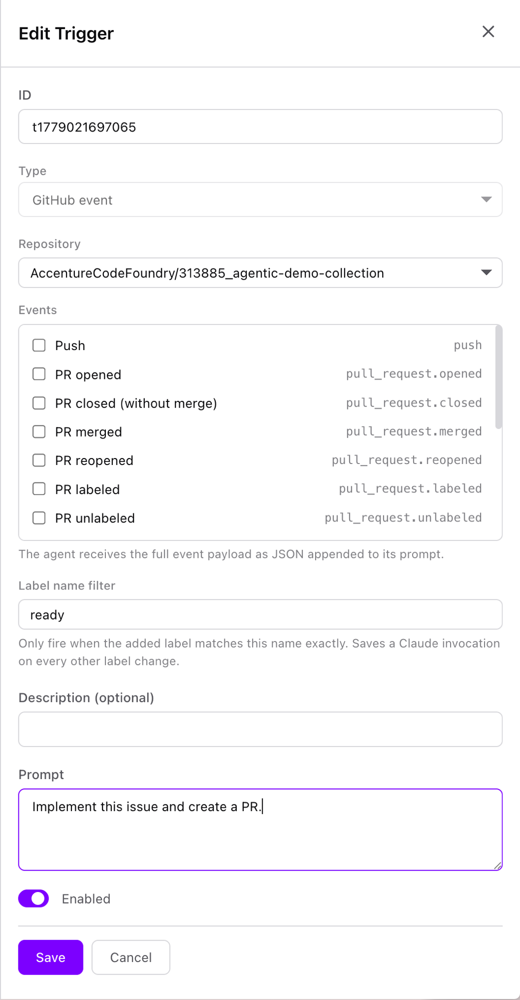

Click **Add Trigger** (or **Save** when editing). The Developer is now
wired to react: as soon as the BA applies `ready` to issue #20 (after our
"yes" in §2.5), the Developer will spin up with the issue payload and the
prompt `Implement this issue and create a PR.`

### 3.3 Apply the `ready` label — the actual hand-off

The trigger only fires when the label transition actually happens on
GitHub. Two ways to make that happen:

- **Tell the BA "yes"** in the chat from §2.5 — the BA applies the label
  itself via `gh issue edit … --add-label ready`.
- **Apply the label manually** on github.com — useful for the demo because
  it makes the hand-off step visible to the audience.

For this run we go the manual route. Open issue #20 on github.com, expand
the **Labels** picker in the right sidebar, and tick **`ready`** in the
*Favorites* group.


The moment the label is saved, GitHub fires the `issues.labeled` webhook;
Agentic Studio routes it to the Developer agent's trigger; the agent
receives the full event payload (issue title, body, label name, repo,
sender, …) appended to its `Implement this issue and create a PR.` prompt
and starts working in its sandboxed clone of the repository.

### 3.4 Watch the Developer pick up the work

Switch the Agent Chat view to **Bank Transfer Team · Developer** (orange
dot in the agent list = currently working). The center pane shows the
system notice that documents the hand-off:

> ⚡ Trigger fired (GitHub: `issues.labeled` on
> `AccentureCodeFoundry/313885_agentic-demo-collection`) — starting work…
> @bank-transfer-team-generic-1:local

Note the underlying instance name is still `bank-transfer-team-generic-1`
— renaming the agent to "Developer" was purely cosmetic.

The right **Log** panel streams the first few seconds of the agent's work:

- `14:45:14 trigger.fired` — `t1779021697065`
- `14:45:14 claude.invoke` — Claude (7911 chars of prompt + payload)
- `14:45:15 system_init` — session bound to `claude-sonnet-4-6`
- `thinking` — *"Let me start by reading the memory files and
  understanding the context, then implement the issue."*
- `Read /workspace/agents/bank-transfer-team-gen…` — agent opens its
  memory files (per-agent persistent notes — Agentic Studio's equivalent
  of `CLAUDE.md`)
- More `Read`s — walks the bank-transfer-app to confirm the current state
  of `TransferForm.tsx`, `TransferForm.css`, the backend, etc.
- `thinking` — *"Now I have a good understanding of the code. Let me also
  check the CSS file to understand the existing styles so I can add new
  ones consistently."*

From here the Developer runs autonomously: it reads the relevant code,
plans the change set, edits files, runs whatever tests exist, commits to
a feature branch, and opens a PR on GitHub. The audience can either
watch the live log on the right or come back later — once the agent
finishes, the chat shows the summary and the PR link.

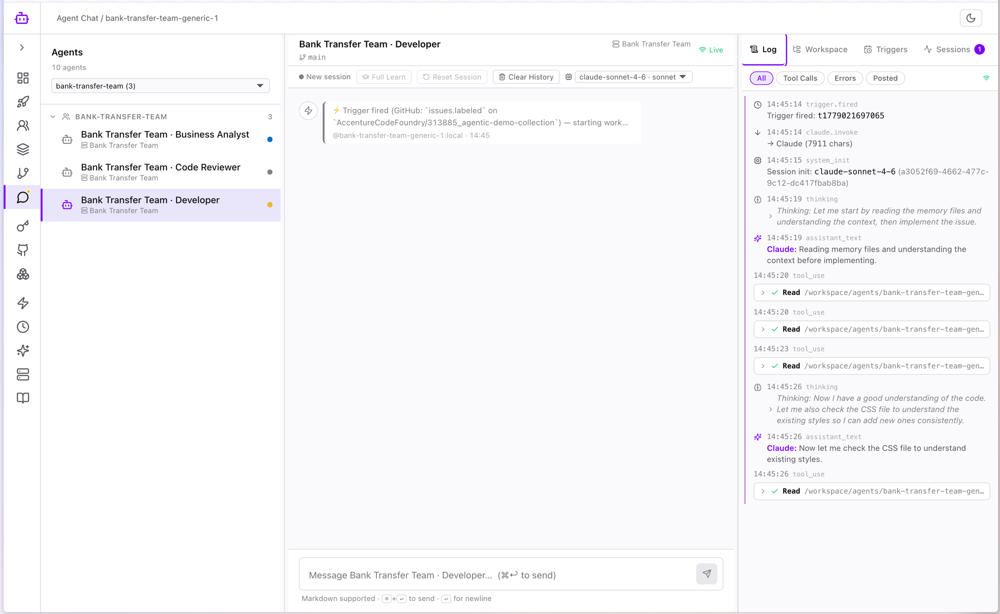

### 3.5 Meanwhile: configure the Code Reviewer trigger

The Developer will eventually open a Pull Request — and we want the second
Generic Agent (renamed to **Code Reviewer** earlier) to react automatically
when that happens. The trigger for that hand-off is
`pull_request.opened`, with no label filter.

> **Order matters**: configure the Code Reviewer trigger *while the
> Developer is still working*. If you wait until the Developer has already
> opened the PR, the trigger isn't subscribed yet and the Reviewer won't
> fire — you'd have to manually push another PR event (close + reopen, or
> a new PR) to nudge it.

Switch to **Bank Transfer Team · Code Reviewer** in the agent list, open
the **Triggers** drawer, click **Add Trigger**:

| Field | Value | Why |
|---|---|---|
| ID (optional) | *(leave empty)* | Auto-generated |
| Type | `GitHub event` | Trigger on a GitHub webhook |
| Repository | `AccentureCodeFoundry/313885_agentic-demo-collection` | Scopes the listener |
| Events | ☑ **PR opened** (`pull_request.opened`) | Fire when a new PR is created |
| Description (optional) | *(leave empty)* | |
| Prompt | `Start a code review for the new PR.` | Tells the Reviewer what to do with the PR payload |
| Enabled | ON | Activate immediately |

Note there is **no label filter** here — every newly opened PR in the
repo will fire the Reviewer. If you want the Reviewer to skip e.g.
auto-bot PRs, add a label filter or scope it by author later.

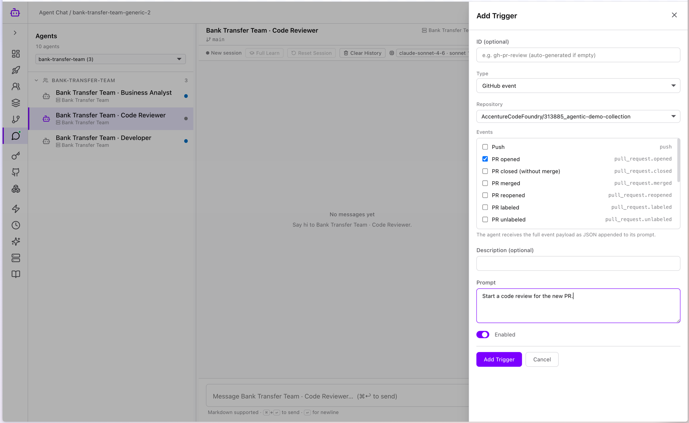

Click **Add Trigger**. The Code Reviewer is now wired to react to any
new PR in the repo — including the one the Developer is about to open.

### 3.6 Developer finishes, opens the PR

Back on the Developer's chat. The agent has worked through its 3-step
TODO list (visible in the bottom-right log: "TODO 3/3 · all done"):

- ✅ Implement IBAN validation in `TransferForm.tsx`
- ✅ Add validation styles to `TransferForm.css`
- ✅ Create PR for issue #20

The chat now shows a summary message: branch
`feature/iban-validation-issue-20`, **PR opened** at
`https://github.com/AccentureCodeFoundry/313885_agentic-demo-collection/pull/22`,
and a per-file change list mapping each change back to an acceptance
criterion (AC-1 … AC-7) — the same ones the BA wrote into the issue.

The Developer also reports the spend (`$ 0.7441` for this run) and the
header now shows the working branch instead of `main`.

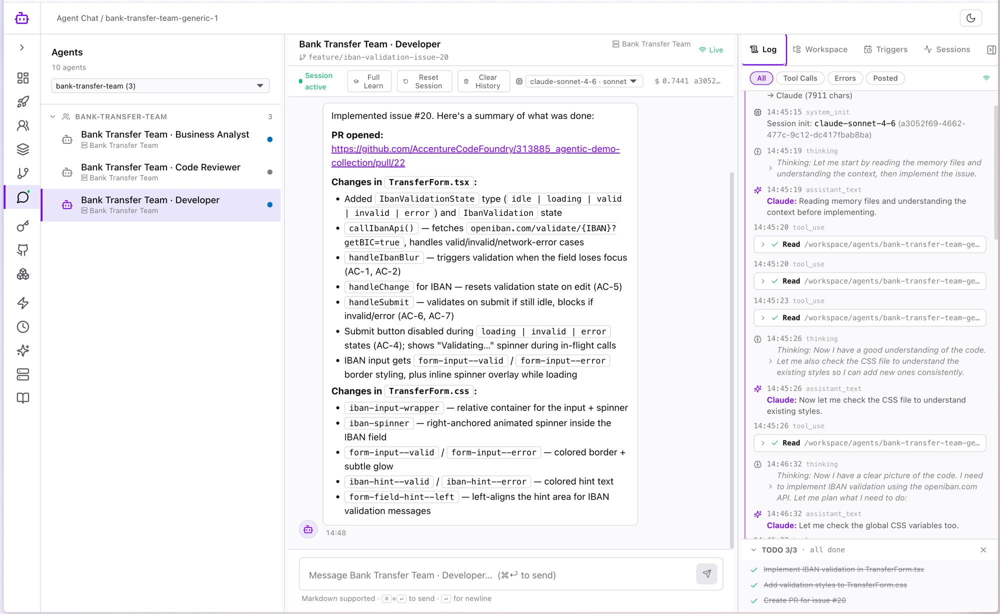

Open the linked PR on github.com to see the same content as an actual
GitHub artefact — title `feat(demo-02): validate IBAN via openiban.com
API`, branch `feature/iban-validation-issue-20` → `main`, file diff
scoped to
`demo-02-iban-validation/bank-transfer-app/frontend/src/components/`,
`+115 / −19`. The diff implements exactly the AC the BA wrote in §2.6:
`callIbanApi(iban)` fetching `openiban.com/validate/{IBAN}?getBIC=true`,
fail-closed error handling ("IBAN validation is currently unavailable.
Transfer cannot be submitted."), and the `valid`/`invalid`/`error` state
transitions that drive the UI.

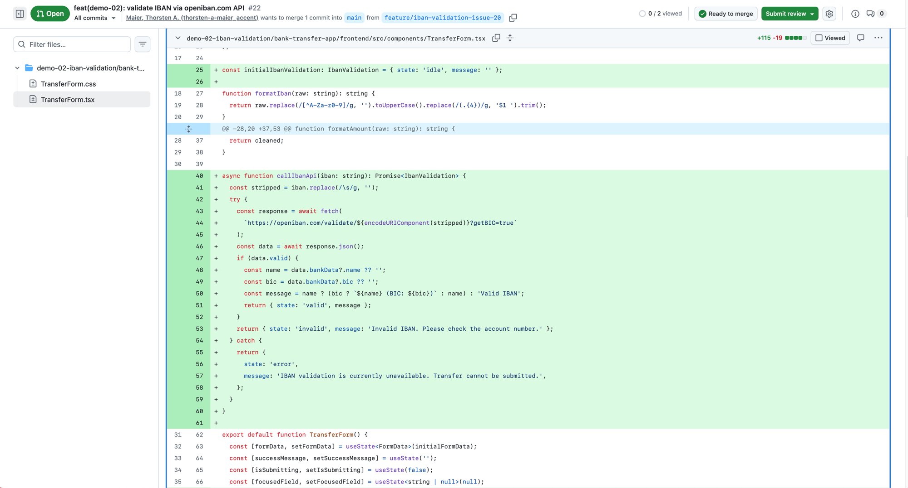

The moment GitHub creates PR #22, the `pull_request.opened` webhook fires
— and because we wired up the Code Reviewer's trigger in §3.5 a moment
ago, the Reviewer agent immediately starts on the new PR. The agent list
on the left now shows the Reviewer with its "active work" dot lit up.

For this walkthrough we stop here — the full code review flow is the
same pattern we've already seen twice (trigger fires → agent reads code
→ posts findings as PR comments). The point of §3.5 + §3.6 was just to
**show the hand-off works** between two agents in the team, without
manual orchestration.

---

# Phase 3 — Code Reviewer (not demoed end-to-end)

The Code Reviewer's full output (PR review comments, approve/request
changes) is not part of this walkthrough. The setup in §3.5 is enough
to demonstrate that the Reviewer reacts autonomously to the Developer's
PR; from there the same patterns we already saw (read code → produce
structured output → post via `gh`) drive the rest of the workflow.

---

# Closing — this was the simple flow

The walkthrough you just saw is **deliberately a minimal slice** of what
Agentic Studio can do: three agents (BA + Developer + one Reviewer), one
hand-off label (`ready`), one event-driven trigger
(`pull_request.opened`), no parallelism, no safety-net cron, no triage,
no community engagement, no policy gates.

The studio ships with **a far richer catalogue of predefined roles** that
slot together into a full agentic SDLC the moment you wire them in. The
diagram below — accessible in the Team Wizard via **View workflow
diagram** (§1.4) — shows the canonical end-to-end flow:

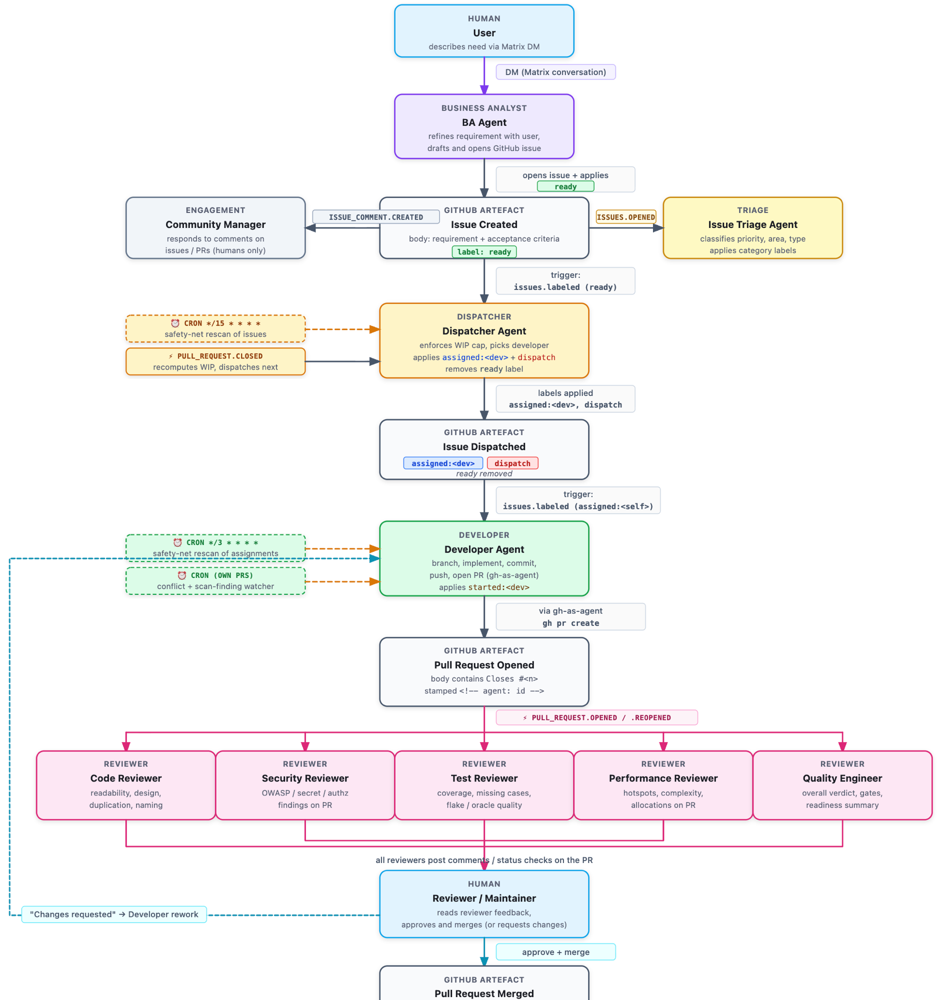

What we **did** demo, mapped onto the diagram:

| Box on the diagram | Our walkthrough |
|---|---|
| **BA Agent** (purple, top) | §2 — Phase 1 |
| **Developer Agent** (green, middle) | §3.1 – §3.6 — Phase 2 |
| **Code Reviewer** (pink, one of five) | §3.5 — trigger configured, runtime not shown |
| Hand-off label `ready` | §2.5 (BA asks) → §3.3 (label applied) |
| Trigger `pull_request.opened` | §3.5 |

What we **didn't** demo, but the studio supports out of the box:

- **Issue Triage Agent** — classifies priority/area/type, applies category
  labels on every newly opened issue
- **Community Manager** — first-line responder for human comments on
  issues and PRs
- **Dispatcher Agent** — enforces a work-in-progress cap, picks which
  `ready` issue to release to which developer next, with a cron-based
  safety-net rescan and `pull_request.closed` recompute
- **Multiple parallel reviewers** on every PR: Code Reviewer, Security
  Reviewer (OWASP / secret / authz), Test Reviewer (coverage, missing
  cases, flake quality), Performance Reviewer (hotspots, complexity,
  allocations), Quality Engineer (overall verdict, gates, readiness
  summary) — all firing on `pull_request.opened` / `.reopened`, all
  posting structured findings as PR comments / status checks
- **Cron safety-nets** for the Developer (every 3 minutes — rescan of
  missed `assigned:<self>` events, plus own-PR conflict-and-scan watcher)
- **Human Reviewer/Maintainer** loop — "changes requested" routes back to
  the Developer for rework, "approve + merge" closes the loop
- **Round-trip events** like `gh-as-agent gh pr create`, `started:<dev>`
  stamping, and PR-body conventions (`Closes #<n>`, `<!-- agent: id -->`
  stamps) that the studio relies on for attribution and traceability

Every box on that diagram is a **predefined role** in the Team Wizard's
catalogue (Step 4 of §1.4). Adding any of them to a team is a checkbox;
their triggers and prompts come preconfigured. The custom-trigger flow we
used in §3.2 / §3.5 is the **escape hatch** for cases the catalogue
doesn't cover — but the default position is "compose from the catalogue".

That's the message to land with: **what we just built is the smallest
useful agentic team. Production teams routinely run the full diagram.**

---

## Beyond predefined roles — Flows & BriefingPacks

The role catalogue from the previous section is **one** of two
composition layers in Agentic Studio. The roles you saw are generic
specialists ("a developer that handles general developer work", "a code
reviewer that reviews any PR") and they're orchestrated **implicitly**
through GitHub labels and webhook events.

For complex, multi-step pipelines — where you need to express that
*agent B consumes the JSON produced by agent A, and agent C only starts
after both B and D have completed* — Agentic Studio has a second,
**explicit orchestration layer** called **Flows**.

### Core concepts

- **BriefingPack (BP)** — a discrete unit of work with a fixed lifecycle:
  `draft → ready → dispatched → claimed → completed → reviewed`. Each BP
  declares its inputs, outputs, and dependencies on other BPs.
- **Flow** — an **Orchestrator** agent that monitors a directory of BPs,
  renders their dependency graph, and manages the lifecycle automatically
  (releases a BP to a worker the moment its dependencies are met).
- **Orchestrator role** — created from the Agents page like any other
  role; setting `role = Orchestrator` is what turns an agent into a Flow.

### What the Flows view looks like

Open **Flows** in the sidebar. The screenshot below is a real flow from
a different demo — a COBOL legacy-analysis pipeline — chosen because it
illustrates the abstraction well:

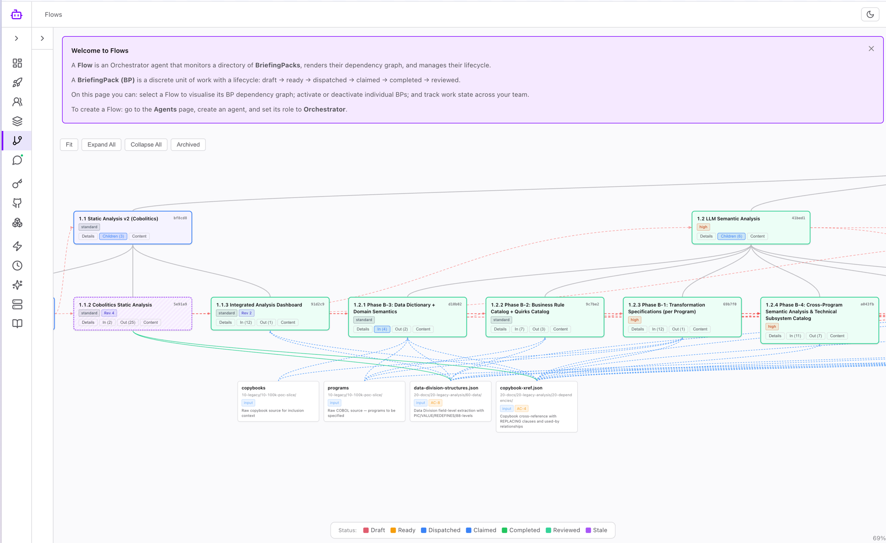

What's on screen:

- **Two top-level BPs**: `1.1 Static Analysis v2 (Cobolitics)` and
  `1.2 LLM Semantic Analysis`. Each has children (six in total under
  1.2) that decompose the work further.
- **Per-BP metadata**: priority chip (`standard` / `high`), tabs for
  *Details*, *Children*, *In* (incoming dependencies), *Out* (outgoing
  artefacts produced), *Content*.
- **Dependency edges**: dashed lines connect produced artefacts to the
  BPs that consume them. Different colours = different dependency types
  (red = blocking, blue = data, green = control flow).
- **Input artefacts at the bottom**: `copybooks`, `programs`,
  `data-division-structures.json`, `copybook-xref.json` — primary
  sources for the whole pipeline, tagged `input` plus AC labels
  (`AC-4`, `AC-8`) for traceability.
- **Lifecycle status legend** at the bottom: Draft, Ready, Dispatched,
  Claimed, Completed, Reviewed, Stale.

### Why this matters

The flat role catalogue is the right tool when the work is shaped like a
ticket queue: an issue arrives, a developer takes it, a reviewer reviews
it. The catalogue handles that with zero ceremony.

Flows are the right tool when you need:

- **Fan-out / fan-in** — one BP produces N artefacts, M downstream BPs
  consume different subsets, then a single roll-up BP aggregates the
  results.
- **Repeatable pipelines across similar projects** — encode the dependency
  graph once, instantiate it per project / per legacy system / per
  release; the Orchestrator handles staging, scheduling and rework.
- **Scale via parallelism** — independent BPs in the graph dispatch in
  parallel as soon as their dependencies clear, without manual
  coordination.
- **Audit trail and traceability** — every BP has a stable ID, an explicit
  spec, declared inputs/outputs, and a state-machine you can replay.

> **In short**: the role catalogue is "give my team another seat";
> Flows is "describe my pipeline as a graph and let the orchestrator run
> it". Demo 02 only needed the former; pipelines like the COBOL
> modernization example above need the latter.
