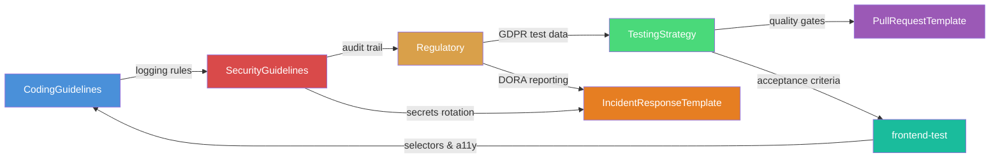

# Knowledge Base — Demo Bank

> Map of Content (MOC) — central entry point for the organizational wiki.
> This is the single source of truth for all SDLC standards.

## Domains

| Domain | Document | Owner | Tags |
|--------|----------|-------|------|
| Architecture | [[CodingGuidelines]] | Engineering Lead | #api-design #naming #error-handling |
| Security | [[SecurityGuidelines]] | CISO | #authentication #input-validation #secrets |
| Regulatory | [[Regulatory]] | Head of Compliance | #psd2 #gdpr #aml #dora |
| Testing | [[TestingStrategy]] | QA Lead | #test-pyramid #quality-gates #coverage |

## Templates

| Template | Purpose | Key Links |
|----------|---------|-----------|
| [[PullRequestTemplate]] | Standard PR structure & Definition of Done | → [[TestingStrategy]], [[SecurityGuidelines]], [[Regulatory]] |
| [[IncidentResponseTemplate]] | DORA-compliant incident handling | → [[Regulatory#5. Operational Resilience (DORA)\|DORA]], [[SecurityGuidelines#3. Secrets Management\|Secrets]] |

## Skills

Skills are procedural guides that **orchestrate multiple domains** into a single workflow.
An agent activating a skill automatically loads all required domain knowledge.

| Skill | Role | Loads Domains | Use When |
|-------|------|---------------|----------|
| [[feature]] | Developer | Architecture + Security + Regulatory + Testing | Implementing a new feature end-to-end |
| [[api-endpoint]] | Developer | Architecture + Security + Regulatory | Implementing a new REST endpoint |
| [[bugfix]] | Developer | Architecture + Security + Testing | Fixing a reported bug |
| [[security-review]] | Security Champion | Security + Regulatory + Testing | Reviewing a PR for security |
| [[frontend-test]] | QA Engineer | Testing + Architecture + Security | Creating Selenium UI tests from Jira acceptance criteria |

## Cross-Domain Dependencies

## How It Works

> [!example] Example: `/skill api-endpoint`
> 1. Agent loads skill [[api-endpoint]]
> 2. Skill declares required domains: `architecture`, `security`, `regulatory`
> 3. Agent loads [[CodingGuidelines]], [[SecurityGuidelines]], [[Regulatory]]
> 4. Embedded sections (`![[...]]`) provide inline context for critical rules
> 5. Developer works through steps — every domain is in context
>
> **Result**: Consistent output regardless of which developer runs the task.

> [!question] Why not just a long prompt?
> - Prompts are per-developer, per-session, and unmaintainable
> - This wiki is **version-controlled**, **reviewed**, and **shared**
> - Skills define **which knowledge is needed** — not just what to do
> - The architecture scales from 1 developer to 100
