# Demo 02 — full 3-phase flow

The workshop deck `03-IBAN-Validation.pptx` shows the same handover model on
every slide (top banner: Feature Idea → Definition → Create User Story →
Handover → Plan → Implement → Manual Test → Handover → Plan UI Test →
Implement UI Test, with the three actors `Product Owner / Developer / UI
Tester` and tools `Chat / Terminal / IDE`). Each slide highlights the active
phase in green; greyed-out boxes mark completed and upcoming work.

## Slide-by-slide

### Slide 1 — The overall picture
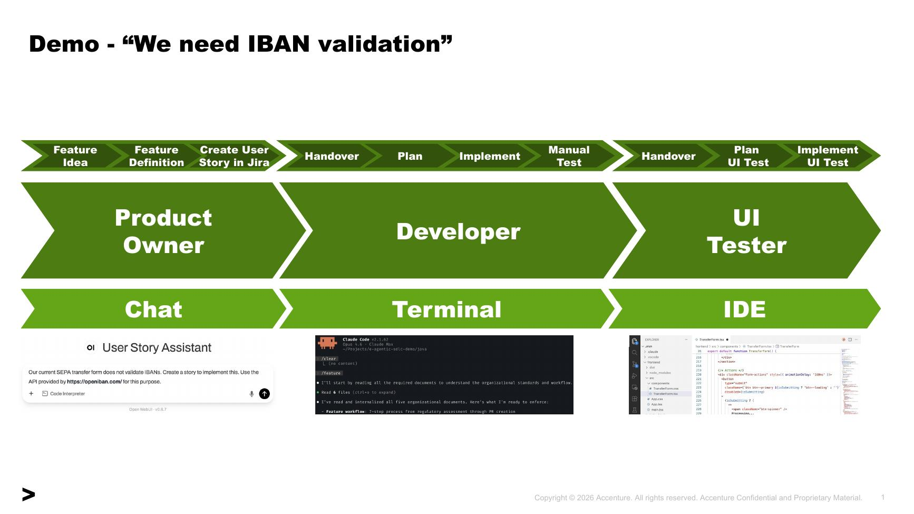

The whole demo on one canvas: three actors, three tools, three handovers.
The Chat shows the IBAN prompt the PO will send. The Terminal shows Claude
Code in the developer's shell. The IDE shows VS Code with the implementation
open. This is the slide to start a workshop session on.

### Slide 2 — Phase 2 begins: Plan (1/3)
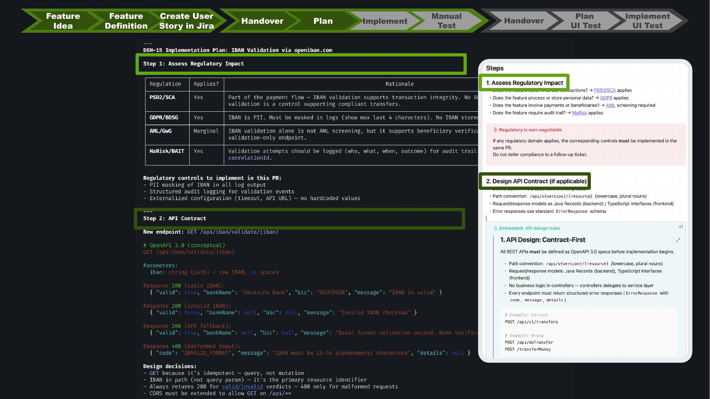

After receiving the Jira/GitHub ticket, the developer agent (Claude Code)
produces a structured implementation plan. The first two sections —
**Regulatory Impact** (PSD2 / GDPR / AML / MaRisk applicability) and **API
Contract** (OpenAPI sketch of `GET /api/iban/validate/{iban}` plus response
shapes) — are derived from the `wiki/regulatory/` and
`wiki/architecture/CodingGuidelines.md` notes. The right-side callout shows
which wiki rules informed each decision.

### Slide 3 — Plan (2/3): Backend implementation and security
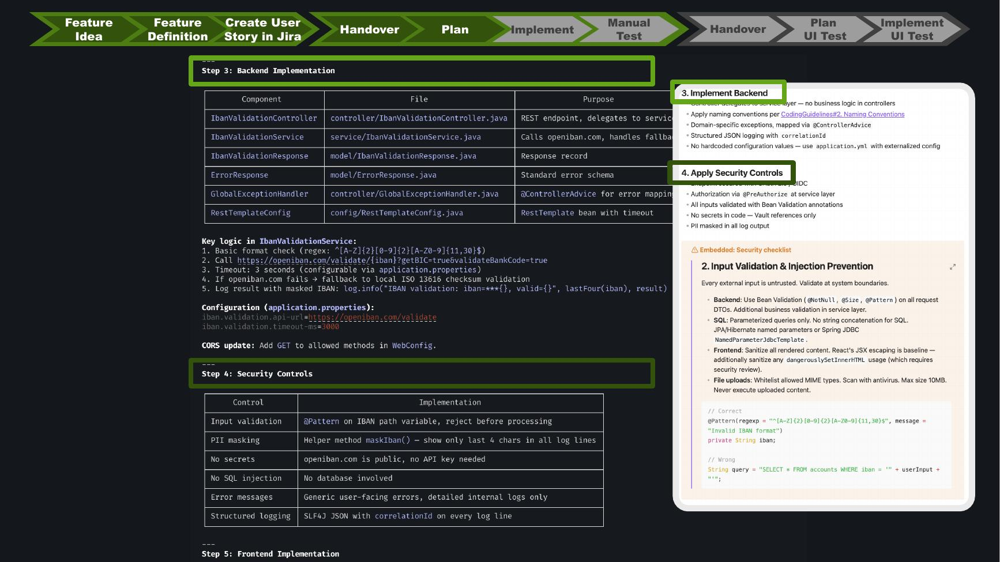

Step 3 enumerates the seven Java files that will be created (controller,
service, models, error handling, REST template config) plus the changes to
`application.properties` and `WebConfig`. Step 4 lists the **security
controls** that follow from `wiki/security/SecurityGuidelines.md` —
@Pattern input validation, PII masking on logging, secrets management,
parameterised SQL (not relevant here), structured logging.

### Slide 4 — Plan (3/3): Frontend behaviour and tests
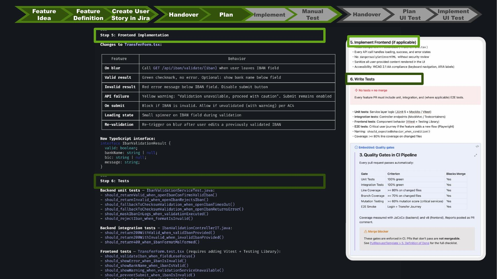

Step 5 maps every UI state (`on blur`, `valid result`, `invalid result`,
`API failure`, `on submit`, `loading state`, `re-validation`) to concrete
behaviour. The TypeScript response shape mirrors the Java DTO. Step 6 lists
the **test inventory**: unit + integration + frontend unit (no E2E yet — E2E
is Phase 3). The "Quality Gates in CI" panel shows the merge blockers:
100 % unit/integration, ≥ 80 % line coverage on changed files, ≥ 70 % branch,
mutation ≥ 60 %, E2E smoke green, Login + Transfer Journey green.

### Slide 5 — Plan (4/4): PR preparation
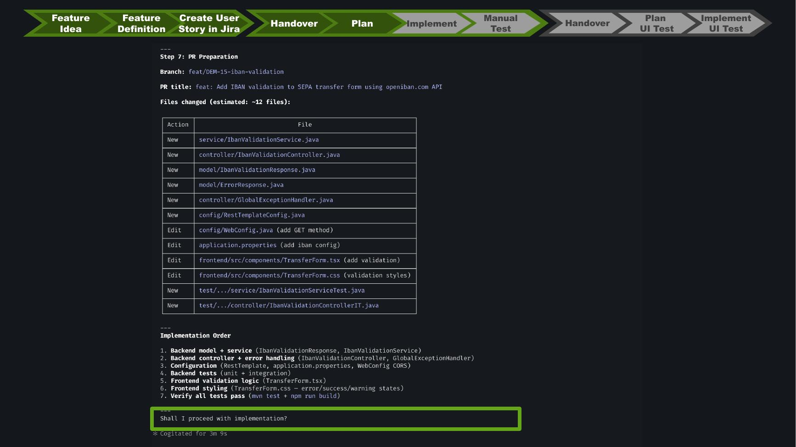

Branch name, PR title, the 12 files that will be touched, and the
implementation order. The agent then asks **"Shall I proceed with
implementation?"** — this is the demo's first human-in-the-loop checkpoint.

### Slide 6 — Implement: live coding session
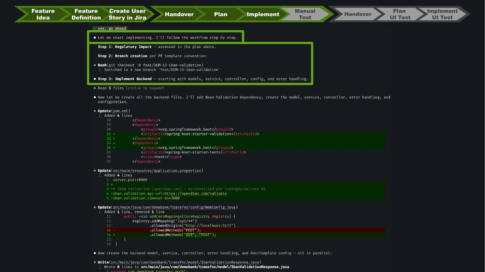

Operator types `yes, go ahead`. Claude executes the plan step by step:
creates the branch, edits `pom.xml`, `application.properties`, `WebConfig`,
then starts writing the model, service, controller, … Every change is shown
as an inline diff. This is the demo's longest single segment (~4-5 minutes
real-time depending on model speed).

### Slide 7 — Manual Test: implementation complete summary
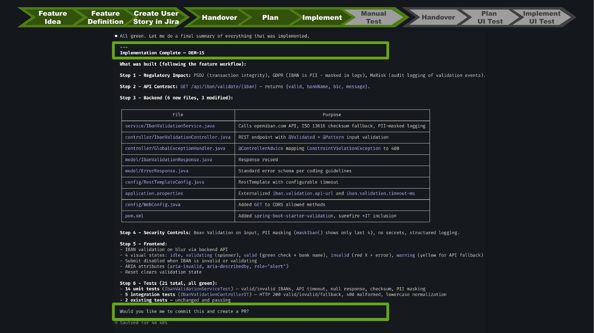

Claude prints a recap table per file with purpose, the security controls
applied, totals (`21 tests`: 14 unit + 5 integration + 2 existing), and asks
**"Would you like me to commit this and create a PR?"** — second
human-in-the-loop checkpoint.

### Slide 8 — Manual Test: the working form
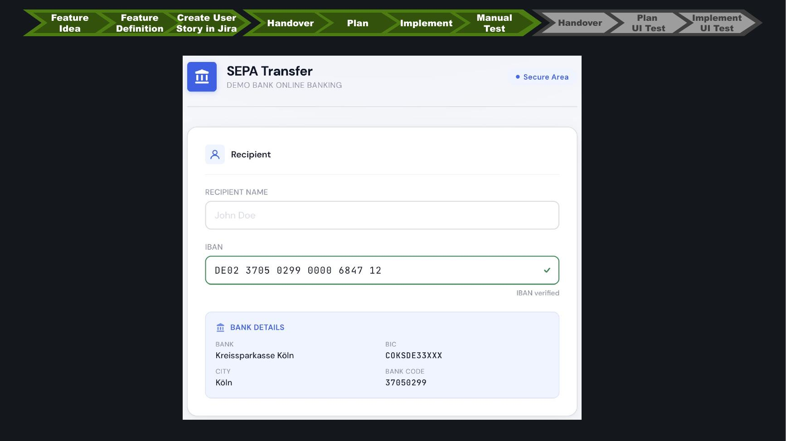

The presenter switches to the browser and pastes a real IBAN (German
`DE02 3705 0299 0000 6847 12`). The form fetches openIBAN, shows a green
checkmark plus a **Bank Details** panel with `Kreissparkasse Köln / BIC
COKSDE33XXX / Köln / 37050299`. This visual moment is the proof-of-life of
Phase 2.

### Slide 9 — Phase 3 begins: handover to UI Tester
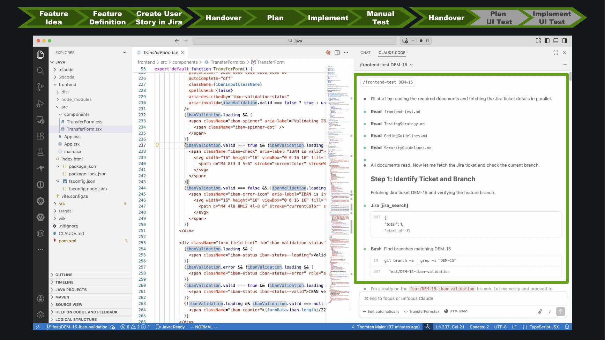

Switch from terminal to IDE (VS Code with Claude Code panel). The agent's
first task is reading `frontend-test.md` plus `TestingStrategy.md`,
`CodingGuidelines.md`, `SecurityGuidelines.md`, then fetching the Jira
ticket via the MCP `jira_search` tool. **Step 1: Identify Ticket and
Branch** — confirms it's working on `feat/DEM-15-iban-validation`.

### Slide 10 — Plan UI Test
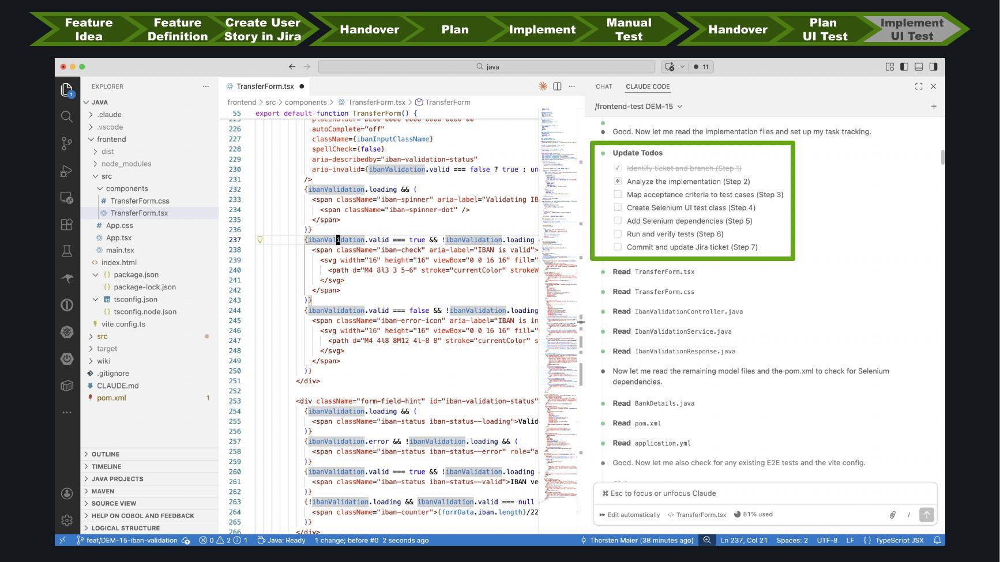

Seven Todos: identify ticket and branch → analyse implementation → map
acceptance criteria to test cases → create Selenium UI test class → add
Selenium dependencies → run and verify tests → commit and update Jira
ticket. Claude reads `TransferForm.tsx`, `TransferForm.css`,
`IbanValidationController.java`, `IbanValidationService.java`,
`IbanValidationResponse.java`, `BankDetails.java`, `pom.xml`,
`application.yml`, and checks whether E2E tests or Vite test config already
exist.

### Slide 11 — Implement UI Test: result
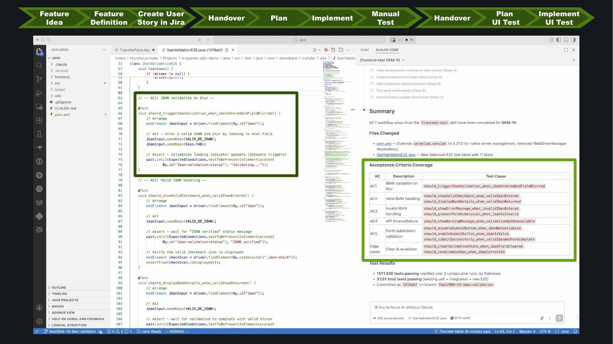

The new `IbanValidationE2E.java` (left pane) is shown side-by-side with the
**AC → Test Case** mapping table (right pane). Test results: **11/11 E2E
tests passing**, 31/31 total tests passing, branch
`feat/DEM-15-iban-validation` committed at `321bab`.

This is the final state of the demo. The reference implementation of the
test class lives in [`../ui-test-reference/`](../ui-test-reference/).

## What the slides do NOT show

- The Phase-1 OpenWebUI chat (PO writing the story). That phase is the
  Agent Garage variant's actual content — see [`../agent-garage-variant/RUNBOOK.md`](../agent-garage-variant/RUNBOOK.md).
- Failure modes (LLM rejecting input, gate blocking premature push, etc.).
  Those live in the runbook's troubleshooting section.
